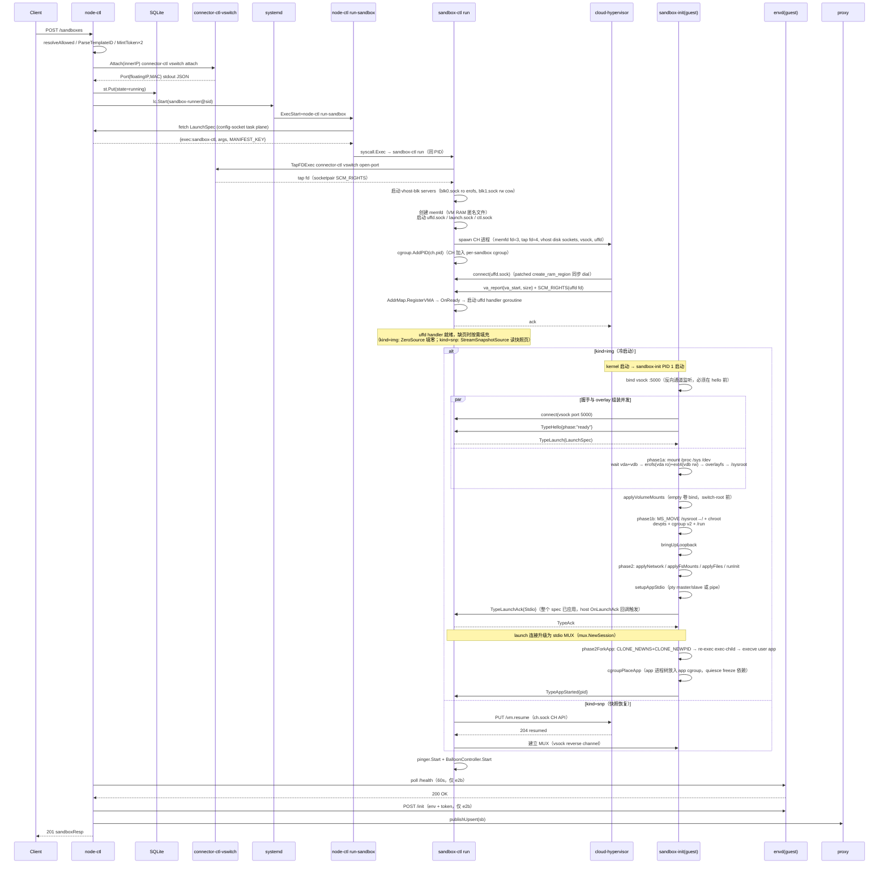
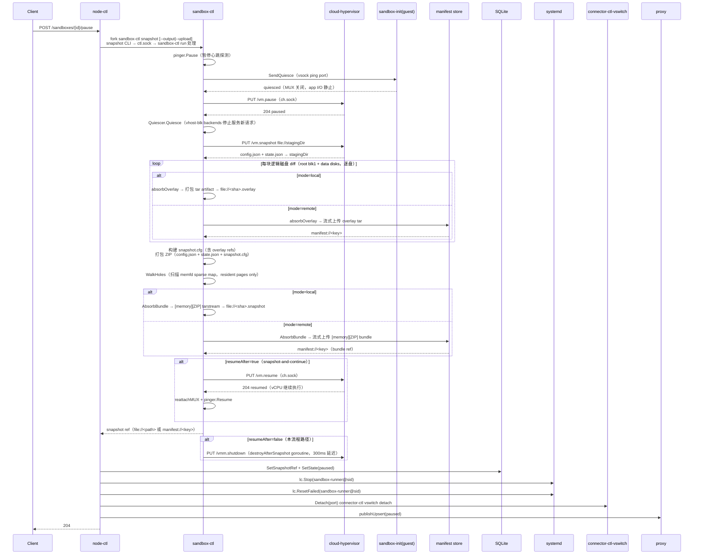
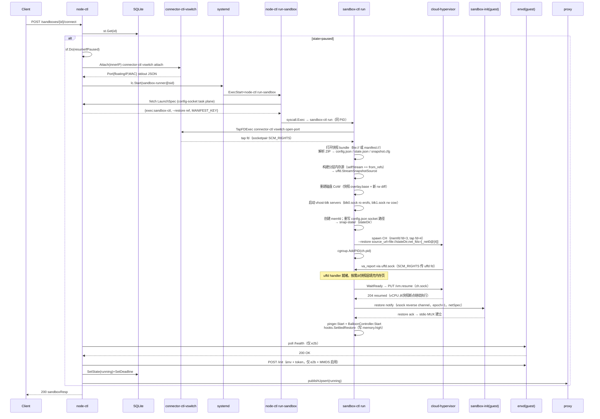
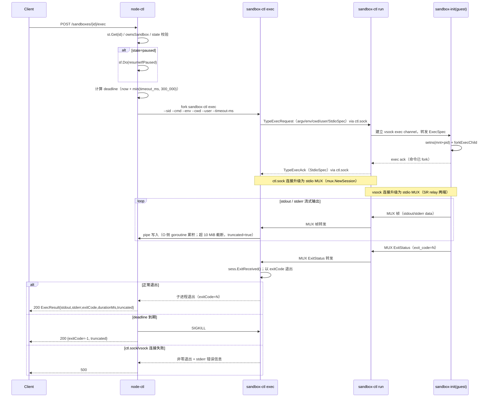
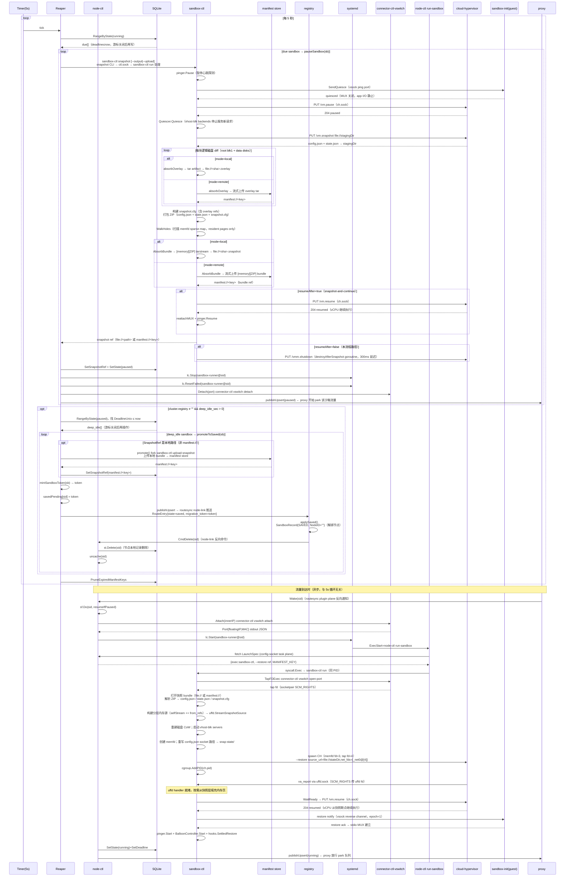
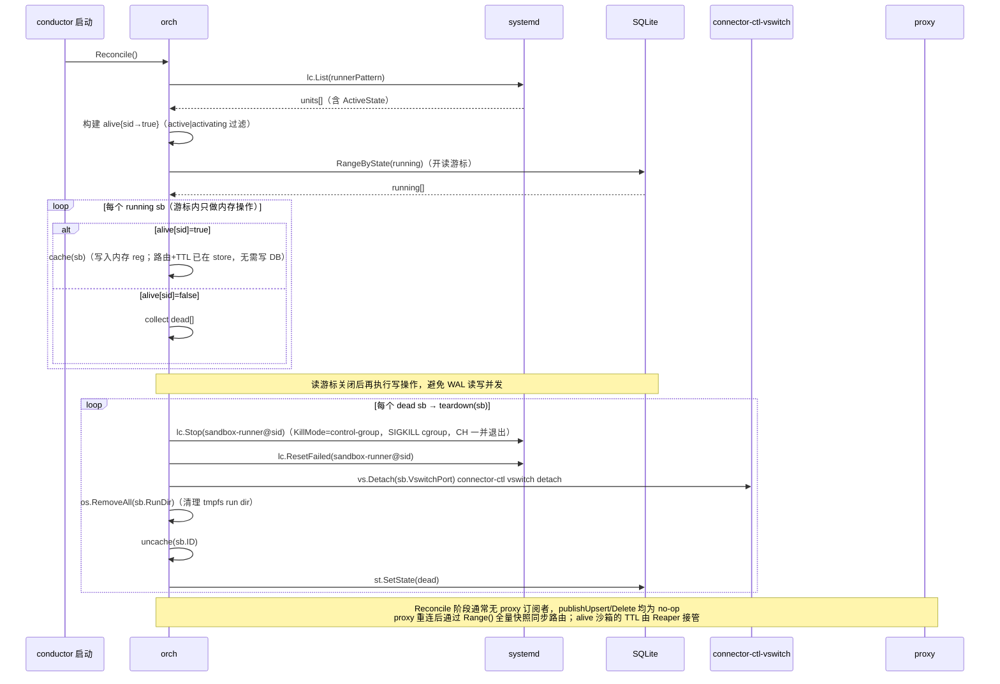
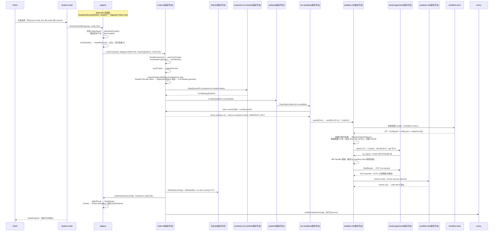
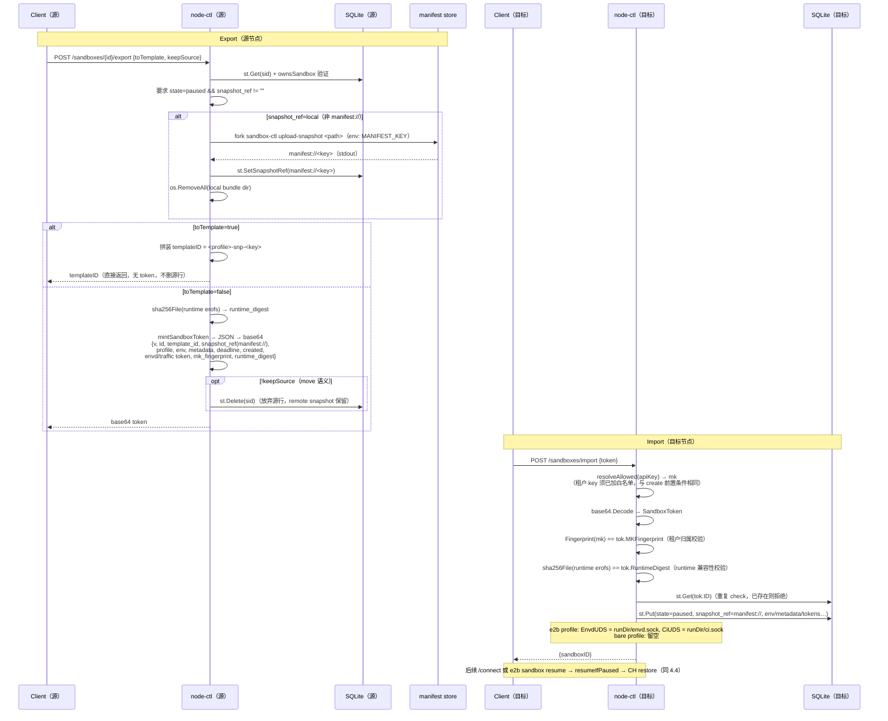

# FE-2.2 node-ctl conductor 沙箱生命周期管理

---

## 1. 需求概述

`node-ctl conductor` 是运行在每个计算节点上的核心 daemon，对外暴露 e2b 兼容的 REST 控制面 API，负责将沙箱从创建、暂停、恢复到销毁的完整生命周期管理落地。它驱动 `sandbox-ctl`、`connector-ctl vswitch` 等底层组件，将沙箱状态持久化到节点本地 SQLite，并通过 routesync 协议实时通知数据面 proxy 更新路由表。

**当前版本策略**：覆盖单节点全生命周期（create / pause / resume / kill / TTL reaper / reconcile / export / import）；集群 node-link 作为扩展功能在同一 conductor 进程内可选启用。模板构建 pipeline 不在本文档范围内。

---

## 2. 需求分析

### 2.1 Goals & Non-Goals

**Goals**

| # | 目标 | 验收方法 |
|---|------|---------|
| G-1 | 兼容 e2b SDK 发出的 REST 请求（create/get/list/kill/pause/connect/timeout/exec），支持 kind=img 冷启动和 kind=snp 快照启动两种模式 | e2b Python SDK 不改动直接对接；分别以 kind=img 和 kind=snp 模板创建沙箱，均返回有效 {sandboxID, envdAccessToken, domain} |
| G-2 | 沙箱生命周期状态（running/paused/dead）持久化，conductor 重启后可恢复 | kill -9 conductor 后重启，running 沙箱被正确 adopt 或 teardown |
| G-3 | paused 沙箱可通过 /connect 或数据面流量透明唤醒 | SDK `sandbox.resume()` 及 park/wake 路径均可触发恢复 |
| G-4 | TTL 超时自动挂起（pause），不中断数据面已建连接；集群模式下 deep_idle_sec 到期后进入深度休眠（SAVED）| timeout=300s 的沙箱 300s 后自动进入 paused；集群模式下深度休眠后可在任意节点 import + resume |
| G-5 | 沙箱跨节点迁移（export/import）：将暂停沙箱打包为含 snapshot manifest ref 的 migration token，在另一节点导入恢复 | `node-ctl export-sandbox` / `node-ctl import-sandbox` 可正常执行；导入后沙箱以 paused 状态存在于目标节点，connect 后可正常使用 |
| G-6 | 在 running/paused 沙箱内同步执行任意命令（exec），支持返回 stdout/stderr 及退出码；paused 沙箱自动恢复后执行；dead 沙箱返回 404 | `POST /sandboxes/{id}/exec` 在沙箱内运行 `echo hello`，返回正确 stdout 和 exitCode=0；paused 沙箱自动恢复后执行成功 |
| G-7 | 多租户隔离：每个 API Key 只能操作自己的沙箱 | 不同 API Key 之间的沙箱完全隔离 |

**Non-Goals**

- 不实现 conductor 进程的水平扩展（单节点 daemon）
- 不实现集群级调度（cluster-ctl registry 的职责）
- 不实现容器化沙箱（仅支持 Firecracker microVM）
- 不实现数据面 proxy 本身（proxy 由 `node-ctl proxy` 子命令承担）

### 2.2 交付范围

| 编号 | 功能模块 |
|------|---------|
| D-1 | 沙箱 CRUD API（create / get / list / kill / timeout）|
| D-2 | pause / connect（resume）控制面 API |
| D-3 | 沙箱状态机：running → paused → dead，含 Reaper TTL 自动挂起 |
| D-4 | 启动恢复（Reconcile）：conductor 重启后 adopt 或 teardown 存量沙箱 |
| D-5 | 本地 SQLite 持久化 + manifest key AES-256-GCM 加密 |
| D-6 | config-socket 三平面（task / admin / api）|
| D-7 | routesync publishUpsert/Delete 通知数据面 |
| D-8 | 跨节点 export-sandbox / import-sandbox（migration token）|
| D-9 | 集群 node-link（可选，`cluster.registry` 非空时启用）|

### 2.3 友商分析

| 维度 | E2B Cloud | fly.io Machines | 本方案 |
|------|-----------|-----------------|--------|
| Hypervisor | Firecracker microVM（per-sandbox Go goroutine，FC API over UDS）| Firecracker microVM | cloud-hypervisor（VMM API over UDS）|
| 节点进程模型 | per-node orchestrator binary；Nomad 集群调度；PostgreSQL 主存储 + Redis 事件/缓存；网络槽 Consul KV | flyd 守护进程，REST API + FC | node-ctl conductor（单节点 daemon），systemd sandbox-runner@ 单元；SQLite 单节点状态存储 |
| 生命周期管理 | 状态：running / paused；TTL per-sandbox goroutine（endAt）；auto-pause + auto-resume（流量触发）| REST API + Firecracker，节点有本地状态 | 兼容 e2b API 协议；状态机 + TTL Reaper + Reconcile |
| 挂起/恢复 | FC snapshot：UFFD memfile diff（全量内存）或 filesystem-only 两种模式；rootfs via NBD overlay + dedup → GCS | `fly machine stop/start` | CH 原生 VM snapshot（CPU + 内存 + 设备状态）+ vhost-blk 块快照；`/connect` 触发透明恢复；快照数据（内存 + 磁盘）经 FastCDC 变长分块 + 收敛加密写入 manifest store，相同内容块跨沙箱/跨模板共享（content-addressed dedup），全零块不存储 |
| 块设备/存储 | NBD（Network Block Device）+ 本地 block dedup（pause 时逐页比对 upper vs base，相同页不写入 diff，仅上传真正变化块）+ peer-to-peer chunk 传输（Redis registry）+ GCS 持久化 | 未公开 | vhost-blk（virtio-blk over vhost）+ 3 级缓存（L1 RocksDB / L2 EC 节点池 / L3 OBS）|
| 内存管理 | FC Balloon（替代旧版 FPR 以避免 vsock 超时死锁）；per-sandbox cgroup `/sys/fs/cgroup/e2b/<sid>`，FD 在 fork 时传入 FC 进程 | 未公开 | BalloonController（替代 virtio FPR）；adopt mode：sandbox-ctl 与 CH 共享 unit cgroup |
| exec 实现 | envd Connect RPC streaming（vsock port 49983）；Start 返回 process 事件流（stdout/stderr/exit）| `fly machine exec` | 控制面：`sandbox-ctl exec`（node-ctl fork 子进程，result pipe 传 exit_code）；数据面：envd UDS 直连（streaming，stdout/stderr 帧累积返回）|
| 租户隔离 | API Key 绑定用户（PostgreSQL teams 表）| org token | manifest_key 白名单 + HMAC-SHA256 |
| 节点恢复 | 重启后从 PostgreSQL 读取 running 列表；孤儿 FC 进程处理方式未见代码，推测 kill 后从快照恢复 | 节点重启后 Machine 状态由 API server 恢复 | Reconcile：align store(running) vs systemd 实际状态 |
| 跨节点迁移 | 内部有 snapshot/restore；不对外暴露 migration API | FC snapshot/restore（非 CRIU；CRIU 为容器进程级工具，与 microVM 迁移机制不同）| export/import + migration token |

### 2.4 需求约束

- **依赖 sandbox-ctl**：沙箱启动/快照/info 均通过 `exec sandbox-ctl` 完成，sandbox-ctl 必须与 node-ctl 并存于同一目录或 PATH
- **依赖 connector-ctl vswitch**：网络 Attach/Detach 通过 `exec connector-ctl vswitch` 完成，需提前配置 vswitch（`sw0`）
- **依赖 systemd**：沙箱以 `sandbox-runner@<sid>.service` 运行，conductor 必须有 systemd D-Bus 权限
- **checkpoint.mode=remote 时**：export/import 需要远端 manifest store（S3/OBS），local 模式仅支持节点内恢复
- **最大并发沙箱数**：受 vswitch BPF `MAX_PORTS=4096` 硬上限约束

---

## 3. 解决方案

### 3.1 User Stories

#### Story 1：基于展平镜像冷启动沙箱

```
作为一个 SDK 用户，我想要通过模板 ID（kind=img）从展平 erofs 镜像冷启动一个沙箱，
以便在干净的模板环境中运行代码或命令。
```

**外部表现**：POST /sandboxes 指定 kind=img 的 template_id；conductor 从 manifest store 读取 `bare-img-<key>`，经 vhost-blk 挂载后启动 VM，等待 envd /health 就绪（最长 60s）；返回 `{sandboxID, envdAccessToken, domain}`。SDK 持有 token 后可通过 `<port>-<sid>.<domain>` 接入 envd 或用户端口。沙箱以 `sandbox-runner@<sid>.service` 运行，调用方无需感知节点细节。

#### Story 2：基于内存快照启动沙箱

```
作为一个 SDK 用户，我想要从模板的预置内存快照（kind=snp）快速恢复沙箱，
以便跳过 OS boot 和 envd 初始化，获得比冷启动更短的就绪时间。
```

**外部表现**：POST /sandboxes 指定 kind=snp 的 template_id；conductor 从 manifest store 读取快照 chunks，经 CH restore 恢复 CPU + 内存 + 设备状态，envd 接受请求后立即返回 `{sandboxID, envdAccessToken, domain}`；相同内容块跨沙箱/跨模板共享（FastCDC + 收敛加密 dedup），启动延迟显著低于冷启动。

#### Story 3：沙箱暂停和唤醒

```
作为一个 SDK 用户，我想要主动暂停一个运行中的沙箱（保留全量内存快照），
并在需要时通过 API 或数据面流量透明唤醒，
以便在不丢失执行状态的前提下节省计算资源。
```

**外部表现**：POST /sandboxes/{id}/pause 触发 CH 原生 VM snapshot + vswitch slot 释放，快照经 FastCDC + 收敛加密写入 manifest store；proxy 路由切换为 park 模式，已建连接不中断；后续 POST /sandboxes/{id}/connect 或数据面流量触发透明 resume（sf.Do 单飞去重），客户端无需重试。

#### Story 4：沙箱超时自动挂起和深度休眠

```
作为一个平台运营者，我希望空闲超过 TTL 的沙箱被自动挂起以回收计算资源，
长时间无访问的沙箱进入深度休眠以释放节点 slot，
以便提升节点利用率、降低运营成本。
```

**外部表现**：Reaper 每 5s 扫描 running 表，`deadline_unix < now` → 自动 pauseSandbox（vswitch slot 释放，proxy 切换 park 模式，数据面已建连接不中断）；集群模式下 `deep_idle_sec` 到期 → promoteToSaved（节点记录删除，registry 持有 `SAVED + migration token`），任意节点可通过 `ReserveSandbox → import + resume` 恢复为 running。

#### Story 5：跨节点迁移沙箱

```
作为一个运维人员，我想要将一个已暂停的沙箱从节点 A 迁移到节点 B，
以便在节点 A 计划下线前保全沙箱状态，在新节点继续使用。
```

**外部表现**：`node-ctl export-sandbox <sid>` 输出 base64 migration token（含 snapshot manifest ref + 元数据）；在节点 B 执行 `node-ctl import-sandbox <token>` 导入为 paused 状态；再通过 `POST /sandboxes/{id}/connect` 或 `e2b sandbox resume <sid>` 恢复；原节点记录删除，新节点持有完整快照，对 SDK 用户透明。

#### Story 6：在沙箱中执行命令

```
作为一个 SDK 用户，我想要在沙箱内同步执行任意命令并获取 stdout、stderr 和退出码，
以便在沙箱环境中完成构建、测试或文件操作等任务。
```

**外部表现**：POST /sandboxes/{id}/exec 携带 `{cmd, envs, cwd, timeout_ms}`；paused 沙箱自动恢复后执行；命令完成后返回 `{stdout, stderr, exit_code, duration_ms}`；stdout + stderr 合计不超过 10 MiB（超出截断并附 `"truncated": true`）；超时时命令被 SIGKILL，`exit_code: -1`，HTTP 仍为 200；dead 沙箱返回 404。

### 3.2 架构影响分析

conductor 是节点数据面和控制面的枢纽，架构影响涵盖以下元素（详细交互见 §4.2 / §4.4 时序图）：

**新增组件**：无（利用现有 sandbox-runtime、sandbox-vswitch、sandbox-accelerator）

**技术选型**：
- 控制面：Go `net/http` 标准库，`log/slog` 结构化日志
- 存储：`modernc.org/sqlite`（pure-Go，CGO_ENABLED=0），WAL 模式
- 加密：AES-256-GCM（secretbox），用于 manifest key 静态加密
- 进程管理：`github.com/coreos/go-systemd/v22`，D-Bus 接口

### 3.3 功能规格

#### 沙箱状态机

```
              Create
    ∅ ──────────────────────► running ◄─────────────────────────────┐
                                │   │                               │
              Pause API /       │   │ Kill                          │
              Reaper running    │   │ (st.Delete)                   │
              TTL 到期          │   ▼                               │
                                │   ∅（记录删除）                   │
                                │                        Connect /  │
                                ▼                        数据平面   │
                              paused ────────────────────────────────┘
                                │
                                │ Kill（st.Delete）
                                ▼
                                ∅（记录删除）

    running ──Reconcile（unit 消失）──► dead

    ── 集群模式（cluster.registry ≠ "" && deep_idle_sec > 0）──────────
    paused ──deep_idle_sec 到期──► ∅（节点记录删除）
                                       registry 持有 SAVED + token
                                       任意节点 ReserveSandbox
                                       → import + resume → running
```

| 状态 | 触发 | 持久化 |
|------|------|--------|
| running | Create / resume | state=running |
| paused | Pause API / Reaper TTL | state=paused + snapshot_ref |
| dead | Reconcile（unit 消失） | state=dead（仅 Reconcile 写入，不自动清理） |
| ∅ | Kill（st.Delete） | 记录删除 |
| SAVED（仅 registry） | deep-idle 到期，节点 promoteToSaved | 节点记录删除；registry SandboxRecord{SAVED, token} |

#### 静态规格

| 指标 | 规格 |
|------|------|
| 最大并发沙箱 | 4096（vswitch BPF `MAX_PORTS`）|
| 默认 TTL | 300s（`sandbox.timeout_sec`）|
| 快照模式 | local（节点绑定）/ remote（manifest store，可配置）|
| 多租户隔离 | manifest_key 白名单 + HMAC-SHA256 per request |
| 加密 | AES-256-GCM，`NODE_CTL_ENCRYPTION_KEY` 或配置 `encryption_key` |
| API 协议 | e2b REST，HTTPS（TLS 证书可选），plain h2c（开发模式）|

#### 与存量特性的配套

| 存量特性 | 配套方式 | 约束 |
|---------|---------|------|
| node-ctl proxy（external 模式）| conductor publishUpsert 通过 routesync 推送路由 | proxy worker 必须已注册 config-socket plugin 平面 |
| MMDS v2（mmds.enabled）| envd 使用 MMDS 重新颁发 access token | 要求 proxy.mode ≠ off；vswitch 的 mgmt-service VIP 必须指向 MMDS listen |
| sandbox-resource 动态资源控制 | resource_listen.enabled=true 时 conductor 内嵌资源控制器 | 沙箱 sandbox.yaml 须配置 control_socket |
| cluster node-link | cluster.registry ≠ "" 时自动连接 registry，路由双向同步 | 需要 node_id、labels、data_endpoint 配置；mTLS 可选 |

#### exec 规格

**执行路径**

```
POST /sandboxes/{id}/exec
  │
  ▼ orch.Exec
  1. st.Get(id) → sb；ownsSandbox 验证
  2. 若 sb.State == dead → 404
  3. 若 sb.State == paused → resumeIfPaused（同 /connect 单飞路径）
  4. exec sandbox-ctl exec（timeout = min(req.TimeoutMs 或 30_000, 300_000) ms）
       └── sandbox-ctl 连接 envd UDS，fork/exec 命令，收集 stdout/stderr，返回退出码
  5. 返回 ExecResult
```

**请求体**

```json
{
  "cmd":        ["python3", "-c", "print('hello')"],   // 必填；argv[0] 为可执行文件
  "envs":       {"KEY": "value"},                      // 可选；追加到 guest 默认环境
  "cwd":        "/home/user",                          // 可选；缺省 envd 默认工作目录
  "timeout_ms": 30000                                  // 可选；缺省 30 000 ms，最大 300 000 ms
}
```

**响应体（200）**

```json
{
  "stdout":      "hello\n",
  "stderr":      "",
  "exit_code":   0,
  "duration_ms": 42
}
```

**静态约束**

| 指标 | 值 |
|------|-----|
| 默认超时 | 30 s |
| 最大超时 | 300 s |
| stdout + stderr 合计上限 | 10 MiB；超出截断，响应附 `"truncated": true` |
| 并发 exec 数（per sandbox）| 无硬上限；受 envd 侧限制 |

**超时处理**：`timeout_ms` 到期时 envd 向子进程发 SIGKILL，返回 `exit_code: -1`，响应码仍为 `200`（exec 本身成功，命令超时属业务语义）。

**状态语义**

| 沙箱状态 | 行为 |
|---------|------|
| running | 直接执行 |
| paused  | 先自动恢复（同 /connect），再执行 |
| dead    | 404 |

### 3.4 风险及设计约束

| 风险 | 缓解措施 |
|------|---------|
| vswitch attach/detach 失败导致 slot 泄漏 | launch 失败时 teardown（包含 Detach）；Reconcile 时检测 running-but-no-unit 的行 → teardown |
| conductor 重启期间 paused 沙箱 wake 无人应答 | proxy park_timeout 期间 conductor 重启（< 5s 目标）；超时 park 返回 404 |
| SQLite WAL 下并发写 | RangeByState 期间不写（调用方收集后再 teardown/SetState）；busy_timeout=5000ms |
| snapshot 失败（磁盘满 / 快照写入失败）| pause 返回错误，沙箱保持 running；上层（cluster）按策略重试或 kill |
| manifest key 泄漏 | 静态加密 + WAL 文件权限 0600；key 不出现在日志、API 响应、env |
| 租户 key 碰撞（hash 非唯一）| store 按 fingerprint 初筛，调用方 decrypt-compare 做精确匹配 |

### 3.5 可选的替代方案

| 维度 | 当前方案 | 替代方案 | 取舍说明 |
|------|---------|---------|---------|
| 存储 | SQLite WAL，pure-Go | etcd / PostgreSQL | etcd 引入网络依赖；单节点 daemon 不需要分布式 KV |
| 进程管理 | systemd D-Bus | 直接 fork+exec | systemd 提供 cgroup 隔离、journal 日志、失败自动清理，fork 方案需自行实现 |
---

## 4. 详细设计

### 4.1 Orchestrator 核心模块

`internal/orch/orch.go`：`Orchestrator` 是控制面的单一入口，实现三个接口：

| 接口 | 消费方 | 功能 |
|------|-------|------|
| `api.Core` | `internal/api/api.go` HTTP handler | 沙箱 CRUD |
| `proxy.Router` | internal proxy（proxy_mode=internal）| 数据面路由查表 + 自动恢复 |
| `configsock.Provider` | config-socket task 平面 | 提供 run-sandbox 的 LaunchSpec |

核心字段：

```go
type Orchestrator struct {
    cfg *config.Config
    st  *store.Store       // SQLite 持久化
    lc  launcher.Launcher  // systemd D-Bus 封装
    vs  vsClient           // connector-ctl vswitch 封装

    mu  sync.Mutex
    reg map[string]*types.Sandbox // 内存热缓存（running 沙箱）

    sf  flightGroup        // per-sid 单飞（resume 去重）

    subsMu sync.Mutex
    subs   map[int]chan routesync.Event // routesync subscribers
    subSeq int
    ...
}
```

**缓存不变性**：`reg` 中的指针永不原地修改——变更通过 `mutateCached`（copy-on-write）或 `cache(new copy)` 完成，确保并发 reader（Route / MMDS 查表）不观测到部分更新。

### 4.2 沙箱 Create 流程

```
POST /sandboxes
  │
  ▼ api.create → orch.Create
  1. resolveAllowed(apiKey) → manifestKey（whitelist check）
  2. ParseTemplateID → 解析 profile/kind/key（失败时 resolveTemplateAlias 补全别名映射，再次解析）
  3. MergeMetadata：req.Metadata ← merge templateBuild.metadata_json（构建预置元数据兜底）
  4. uuid.NewV7() → sid
  5. MintToken × 2 → envdAccessToken, trafficAccessToken
  6. 构建 sb；仅 e2b profile 设置 EnvdUDS / CiUDS（bare profile 无 envd，字段保持空）
  7. launch(ctx, sb, tmpl)
     a. MkdirAll(RunDir, BaseDir)
     b. snapshotConfig（若 kind=snp：读快照 capacity + network）
     c. allocInnerIP(profile, override)
     d. vs.Attach(AttachReq{innerIP, transit...}) → Port{floatingIP, MAC, port}
     e. sandboxParams → Params
     f. p.WriteYAML(<run-dir>/<sid>.yaml)
     g. st.Put(sb)                 ← 写 store（state=running）
     h. cache(sb)                  ← 写内存热缓存
     i. lc.Start(runnerUnit(sid))  ← 启动 sandbox-runner@<sid>.service
     j. waitReady（poll envd /health，timeout 60s）    ← 仅 e2b profile
     k. envdInit（POST /init：env vars + accessToken if MMDS）← 仅 e2b profile
  8. publishUpsert(sb)  ← 通知 proxy
  9. return sandboxResp
```

**LaunchSpec 流程**（config-socket task 平面）：`sandbox-runner@<sid>.service` 在 systemd 单元中执行 `node-ctl run-sandbox`，后者通过 config-socket 拉取 LaunchSpec，exec-replace 为 `sandbox-ctl run --sandbox-id <sid> --config <yaml> --restore <ref>（如有）`。manifest_key 通过 `LaunchSpec.Env["MANIFEST_KEY"]` 注入，不落磁盘。



### 4.3 沙箱 Pause 流程

```
POST /sandboxes/{id}/pause
  │
  ▼ orch.Pause → pauseSandbox(ctx, sb)
  1. snapshot(ctx, sb)
     ├── mode=local: sandbox-ctl snapshot --output <checkpoint.local_dir>/<sid>
     │              → 写入 <checkpoint.local_dir>/<sid>/<sid>.snapshot（文件）
     └── mode=remote: sandbox-ctl snapshot --upload → stdout 64hex key → "manifest://<key>"
  2. sb.SnapshotRef = ref
  3. st.SetSnapshotRef / st.SetState(paused)
  4. 若 cluster.registry != "" && cluster.deep_idle_sec > 0: st.SetDeadline(now + deep_idle_sec)
  5. cache(sb)                       ← 更新内存（state=paused）
  6. lc.Stop(runnerUnit(sid))        ← 停止 systemd 单元（SIGKILL cgroup）
  7. lc.ResetFailed(runnerUnit(sid))
  8. vs.Detach(sb.VswitchPort)       ← 释放 vswitch slot
  9. publishUpsert(sb)               ← 通知 proxy（state=paused，proxy 启用 park 队列）
```

**两种快照模式对比**：

| 模式 | 存放位置 | 可移植性 | 恢复条件 |
|------|---------|---------|---------|
| local（默认）| 节点本地 `/var/lib/sandbox-saved/<sid>/` | 节点绑定 | 只能在同节点恢复 |
| remote | manifest store（S3）`manifest://<key>` | 跨节点 | 任何持有 manifest_key 的节点 |



### 4.4 沙箱 Connect/Resume 流程

```
POST /sandboxes/{id}/connect
  │
  ▼ orch.Connect
  1. st.Get(id) → sb
  2. 若 sb == nil && migrationToken != "": ImportSandbox → insert paused row → re-Get
        └── 若 imported != id（token 归属不匹配）: st.Delete(imported) → 返回错误
  3. ownsSandbox(sb, apiKey) 验证
  4. 若 sb.State == paused:
       sf.Do(sid, resumeIfPaused)      ← per-sid 单飞
         └── resume(ctx, sb)
               ├── 复制 nb = *sb（nb.State=running，刷新 DeadlineUnix）
               ├── launch(ctx, &nb, tmpl)  ← 同 create，kind=snp 时 --restore <ref>
               ├── st.SetState(running) + SetDeadline
               └── publishUpsert(&nb)   ← 解除 proxy park 队列
       lookup(id) 或 st.Get(id) 获取最新状态
  5. 若 timeoutSec > 0: 更新 DeadlineUnix
  6. return sandboxResp
```

**单飞（single-flight）**：并发的 `/connect` 请求或数据面 wake 消息均经过 `sf.Do(sid, ...)` 收敛。第一个 goroutine 执行 `resumeIfPaused`；后续 goroutine 进入 `sf.Do` 时若 sid 已 running，`resumeIfPaused` 内部 check 后立即返回 nil，避免双重 launch。



### 4.5 沙箱 Exec 流程

```
POST /sandboxes/{id}/exec
  │
  ▼ api.exec → orch.Exec(ctx, id, req, apiKey)
  1. st.Get(id) → sb；若 sb == nil → 404
  2. ownsSandbox(sb, apiKey) → 403/404
  3. 若 sb.State == dead → 404
  4. 若 sb.State == paused:
       sf.Do(sid, resumeIfPaused)   ← 与 /connect 共用同一单飞路径
         └── resume 完成后继续执行（TTL 不因 exec 延长）
  5. timeout = min(req.TimeoutMs 若为 0 取 30_000, 300_000) ms
     deadline = now + timeout ms        ← 在步骤 4 完成后重新计算 now
  6. exec sandbox-ctl exec \
         --sid <id> \
         --cmd <req.Cmd> \
         --env <req.Envs> \
         --cwd <req.Cwd> \
         --timeout-ms <deadline - now>  ← fork 时动态计算剩余时间
       sandbox-ctl exec → ctl.sock → sandbox-ctl run → vsock → sandbox-init；
       sandbox-init setns(mnt+pid) 后 forkExecChild，stdout/stderr 经 MUX 透传；
       sandbox-ctl exec 以命令退出码作为自身退出码（fd=3 JSON 为 node-ctl 侧计划接口）；
       内部错误（连不上 ctl.sock 或 vsock 通道等）：sandbox-ctl exec 以非零退出，stderr 记录原因
  7. node-ctl 累积 stdout + stderr；合计超过 10 MiB 时停止读取，标记 truncated=true
  8. 等待子进程退出，或 deadline 到期
       a. 正常退出：读取 fd=3 JSON → exit_code=N
       b. deadline 到期：SIGKILL sandbox-ctl exec → exit_code=-1
       c. fd=3 为空（内部错误）：返回 500，日志记录 stderr
  9. return ExecResult{Stdout, Stderr, ExitCode, DurationMs, Truncated}
```

**与其他 sandbox-ctl 调用的一致性**：`exec sandbox-ctl exec` 与 `exec sandbox-ctl snapshot`、`exec sandbox-ctl info` 遵循同一模式——node-ctl 不直接持有 per-sandbox 的 envd 连接，所有 guest 侧细节封装在 sandbox-ctl 内。

**与 /connect 的关系**：步骤 4 的自动恢复与 `/connect` 走完全相同的 `sf.Do(sid, resumeIfPaused)` 路径——先到的 goroutine 执行恢复，后到的等待同一 future，不会触发双重 launch。exec 不延长 TTL；若沙箱的 TTL 在命令执行期间到期，Reaper 会 pause 沙箱，sandbox-ctl exec 因 vsock 通道中断而返回内部错误（步骤 8c）。

**并发语义**：同一沙箱可并发多个 exec 请求，每次调用独立 fork 一个 sandbox-ctl exec 子进程；node-ctl 层不额外限流。

**超时语义**：`timeout_ms` 超时（步骤 8b）时命令被 SIGKILL，响应码仍为 `200`，`exit_code=-1`（命令超时属业务语义）；若沙箱在恢复阶段超时，返回 `503`；若 sandbox-ctl exec 内部错误，返回 `500`。



### 4.6 Reaper（TTL 自动挂起）

`Reaper` 每 5s 运行，分三步：

```
1. RangeByState(running):
     sb.DeadlineUnix > 0 && now >= sb.DeadlineUnix → collect due[]

2. for sb in due: pauseSandbox(ctx, sb)  ← 同 Pause 流程

3. reapDeepIdle(ctx, now):   ← 集群模式 + deep_idle_sec
     RangeByState(paused):
       now >= sb.DeadlineUnix → mintSandboxToken → savedToken → cluster promote

4. st.PruneExpiredManifestKeys(ctx)  ← 清理已过期的 manifest key 白名单行
```

**注意**：`RangeByState` 持有 SQLite 读游标期间，`pauseSandbox`（写 store）**不在游标内执行**——先 collect，关闭游标后再 pause，避免 WAL 读写并发导致 busy 错误。



### 4.7 Reconcile（启动恢复）

conductor 启动时运行 `Reconcile`，将 store 中 running 状态与 systemd 实际活跃 unit 对齐：

```
1. lc.List(runnerPattern) → alive{sid: true}（active|activating units）

2. RangeByState(running):
     alive[sid] == true  → cache(sb)   // 正常 adopt：路由 + TTL 已在 store
     alive[sid] == false → collect dead[]

3. for sb in dead:
     teardown(ctx, sb)          // Stop + Detach + RemoveAll + uncache
     st.SetState(dead)
```

**场景覆盖**：

| 场景 | 处理 |
|------|------|
| conductor 重启，沙箱正常 running | adopt（cache），无感知 |
| conductor 重启，沙箱 crash（unit inactive）| teardown → dead |
| 节点重启，所有 unit 消失 | 所有 running 行 → teardown → dead |
| 新 conductor 接管旧 conductor 遗留的 unit | adopt 后 Reaper 按 deadline 正常处理 |



### 4.8 Deep-idle 跨节点 Resume（集群模式）

deep-idle 提升为 SAVED 后，registry 持有 migration token，下次有 `(group, route_key)` 触发时由 registry 自动在任意节点执行 import + restore，对客户端透明。



### 4.9 Export / Import（跨节点迁移）

**Export**（`orch.ExportSandbox`）：

```
1. st.Get(sid) + ownsSandbox 验证
2. 要求 state=paused && snapshot_ref != ""
3. 若 snapshot_ref 非 manifest://: promote(local → remote) → 更新 store
        └── promote 成功后 os.RemoveAll(本地快照目录) ← 清理本地 bundle
4. toTemplate=true: 拼装 <profile>-snp-<key> 模板 ID，直接返回（no token）
5. toTemplate=false: mintSandboxToken → base64 token
   SandboxToken {v, id, template_id, snapshot_ref(manifest://), profile,
                 env, metadata, deadline/created, envd/traffic token,
                 mk_fingerprint(SHA256(mk)[:12], NON-SECRET),
                 runtime_digest(SHA256(runtime erofs))}
6. !keepSource: st.Delete(sid)  ← 移动语义：放弃源行，remote snapshot 保留
```

**Import**（`orch.ImportSandbox`）：

```
1. resolveAllowed(apiKey) → mk（目标节点白名单 check）
2. base64.Decode → SandboxToken
3. mk_fingerprint check（确保 token 归属当前 tenant）
4. runtime_digest check（防止在 runtime 不匹配的节点恢复）
5. st.Get(tok.ID) 确认不重复
6. st.Put(&Sandbox{state=paused, snapshot_ref=manifest://...})
        └── 仅 e2b profile 设置 EnvdUDS / CiUDS（bare profile 保持空）
7. 返回 sid；调用方再 /connect 或 e2b sandbox resume 触发恢复
```

**安全边界**：SandboxToken 不含 manifest_key 明文，只有 SHA256 fingerprint。目标节点独立校验 fingerprint，确保同一 tenant。runtime_digest 防止在规格不兼容节点上导入后 restore 失败。



### 4.10 API 设计

#### 4.10.1 对外 API（e2b 兼容）

| 方法 | 路径 | 功能 | 认证 |
|------|------|------|------|
| POST | /sandboxes | 创建沙箱 | X-API-KEY |
| GET | /sandboxes/{id} | 查询沙箱详情 | X-API-KEY |
| GET | /v2/sandboxes | 列举沙箱（cursor 分页）| X-API-KEY |
| DELETE | /sandboxes/{id} | 销毁沙箱 | X-API-KEY |
| POST | /sandboxes/{id}/pause | 挂起沙箱 | X-API-KEY |
| POST | /sandboxes/{id}/connect | 恢复沙箱 / 延长 TTL | X-API-KEY |
| POST | /sandboxes/{id}/timeout | 设置超时 | X-API-KEY |
| POST | /sandboxes/{id}/exec | 在沙箱内执行命令 | X-API-KEY |
| POST | /sandboxes/{id}/export | 导出 migration token | X-API-KEY |
| POST | /sandboxes/import | 导入 migration token | X-API-KEY |
| GET  | /health | 健康检查 | 无 |

**认证**：见 [§4.10.3 认证设计](#41003-认证设计)。

**数据面寻址**（proxy 路由，区别于控制面 `/sandboxes/{id}` 路径寻址）：proxy 支持两种方式定位沙箱：① Host label `<port>-<sid>.<domain>`；② header 对 `E2b-Sandbox-Id`（sid）+ `E2b-Sandbox-Port`（port，缺省 49983）。

**扩展请求头**（配置注入，不改 e2b 协议）：

| Header | 作用 | 存储路径 |
|--------|------|---------|
| `X-Kuasar-Sandbox-Resource` | 覆盖 cpu/memory | `metadata[kuasar-sandbox.resource]` |
| `X-Kuasar-Sandbox-Network` | 覆盖 inner_ip / DNS | `metadata[kuasar-sandbox.network]` |
| `X-Kuasar-Sandbox-Launch` | 附加启动参数 | `metadata[kuasar-sandbox.launch]` |
| `X-Kuasar-Sandbox-Init` | 覆盖 init 行为 | `metadata[kuasar-sandbox.init]` |
| `X-Kuasar-Sandbox-Mounts` | 附加 mount 配置 | `metadata[kuasar-sandbox.mounts]` |
| `X-Kuasar-Sandbox-Files` | 文件注入配置 | `metadata[kuasar-sandbox.files]` |
| `X-Kuasar-Sandbox-Metadata` | 任意业务元数据 | `metadata[kuasar-sandbox.metadata]` |
| `X-Kuasar-Migration-Token` | 迁移令牌（/connect 时自动导入）| `api.MigrationTokenHeader` |

**公共响应结构**（`sandboxResp`，被 POST /sandboxes 和 POST /sandboxes/{id}/connect 复用）：

| 字段 | 类型 | 说明 |
|------|------|------|
| `sandboxID` | string | 沙箱实例 ID |
| `templateID` | string | 模板 ID，格式 `<profile>-<kind>-<64hex>`，如 `e2b-snp-abc...` |
| `clientID` | string | 固定值 `"orchestrator"` |
| `domain` | string | 数据面域名，如 `e2b.dev`；proxy Host label 前缀拼接此域名 |
| `envdVersion` | string | e2b profile 返回 `"0.6.1"`；bare profile 返回 `"0.1.0"`（SDK 版本探测用） |
| `envdAccessToken` | string | 数据面 envd 访问令牌；proxy enforce 模式验 `X-Access-Token`；bare profile 为空 |
| `trafficAccessToken` | string | 数据面流量令牌（与 envdAccessToken 区分，供 proxy 路由鉴权） |
| `alias` | string | 固定空字符串（保留字段，e2b 兼容占位） |

**API 响应码**：

| 情形 | HTTP 码 | 触发端点 |
|------|--------|---------|
| 成功创建沙箱 | 201 | POST /sandboxes |
| 成功查询 / 恢复 / exec / 导出导入 / build 状态 | 200 | GET, POST connect/exec/export/import, GET status |
| 模板注册 / 构建触发成功 | 202 | POST /v3/templates, POST /v2/templates/.../builds/... |
| 成功销毁 / pause / timeout | 204 | DELETE, POST pause/timeout |
| build 文件检查成功 | 201 | GET /templates/{tid}/files/{hash} |
| API key 格式非法 | 401 | 所有受保护端点（auth 中间件） |
| 请求体格式错误 / 入参校验失败 / export-import 业务失败 | 400 | POST /sandboxes（bad body）、/timeout（bad body）、/import（token 缺失）、/connect 或 /export 带 migration token 时、POST /v2/templates/.../builds/...（bad body 或 COPY 上下文未上传）|
| 沙箱不存在或租户不匹配 | 404 | 所有带 {id} 端点 |
| manifest key 不在白名单 | 403 | POST /sandboxes、/export、/import 及 build 端点 |
| 已是 paused 状态 | 409 | POST /sandboxes/{id}/pause |
| files_storage 未配置 | 501 | POST /v2/templates/.../builds/...、GET /templates/{tid}/files/{hash} |
| 其他内部错误 | 500 | 所有端点 |

> **connect body 特例**：`POST /sandboxes/{id}/connect` 的 body decode 错误被静默忽略（`_ = json.Decode(...)`），故 body 格式错误**不**返回 400；仅在携带 `X-Kuasar-Migration-Token` 且导入失败时，通过 `failMigrate` 返回 400。

---

##### POST /sandboxes — 创建沙箱

**请求体**（JSON）：

| 字段 | 类型 | 必填 | 说明 |
|------|------|------|------|
| `templateID` | string | 是 | 模板 ID，格式 `<profile>-<kind>-<64hex>` |
| `timeout` | int | 否 | TTL 秒数；0 或缺省由节点配置的 `default_ttl` 决定 |
| `metadata` | object | 否 | 业务自定义 KV，任意字符串键值对；`X-Kuasar-Sandbox-*` 扩展头同名 namespace 覆盖此字段 |
| `envVars` | object | 否 | 注入 guest 的环境变量 KV，透传给 sandbox-ctl run |
| `secure` | bool | 否 | 保留字段（e2b 协议兼容），当前无效 |

**响应**（201）：`sandboxResp`（见上方公共响应结构）

---

##### GET /sandboxes/{id} — 查询沙箱详情

**路径参数**：`id` — 沙箱实例 ID

**响应**（200）：`sandboxResp` 所有字段，追加以下字段：

| 字段 | 类型 | 说明 |
|------|------|------|
| `state` | string | `running` / `paused`（dead 行已被 kill 删除，不会出现在 Get 响应里） |
| `startedAt` | int64 | 创建时间（Unix 秒） |
| `endAt` | int64 | 截止时间（Unix 秒）；0 表示无 TTL |
| `metadata` | object | 创建时传入的业务 KV，以及 `X-Kuasar-Sandbox-*` 配置命名空间 |

---

##### GET /v2/sandboxes — 列举沙箱

**Query 参数**：

| 参数 | 类型 | 说明 |
|------|------|------|
| `state` | string | 按状态过滤：`running` / `paused`；缺省返回全部 |
| `limit` | int | 每页条数，缺省 100 |
| `nextToken` | string | 上一页响应头 `x-next-token` 的值；缺省从头开始 |

**响应头**：`x-next-token` — 下一页游标；最后一页时缺失。

**响应**（200）：JSON 数组，每项字段：

| 字段 | 类型 | 说明 |
|------|------|------|
| `sandboxID` | string | 沙箱实例 ID |
| `templateID` | string | 模板 ID |
| `clientID` | string | 固定 `"orchestrator"` |
| `state` | string | `running` / `paused` |
| `cpuCount` | int | vCPU 数（节点统一配置值） |
| `memoryMB` | int | 内存大小 MB（节点统一配置值） |
| `diskSizeMB` | int | 可写 overlay 容量 MB（节点统一配置值） |
| `envdVersion` | string | 同 sandboxResp |
| `startedAt` | string | ISO-8601 时间戳，如 `"2024-01-01T00:00:00Z"` |
| `endAt` | string | ISO-8601 时间戳；无 deadline 时回填 startedAt（SDK 要求字段不为空）|
| `metadata` | object | 业务 KV |

---

##### DELETE /sandboxes/{id} — 销毁沙箱

**路径参数**：`id` — 沙箱实例 ID

**响应**：204（成功）/ 404（不存在或租户不匹配）

---

##### POST /sandboxes/{id}/pause — 挂起沙箱

**路径参数**：`id` — 沙箱实例 ID

**请求体**：空（无需 body）

**响应**：

| 情形 | HTTP 码 |
|------|--------|
| 成功挂起 | 204 |
| 已是 paused 状态 | 409 |
| 不存在或租户不匹配 | 404 |
| 快照失败等内部错误 | 500 |

---

##### POST /sandboxes/{id}/connect — 恢复沙箱 / 延长 TTL

**路径参数**：`id` — 沙箱实例 ID

**请求头**（可选）：`X-Kuasar-Migration-Token` — 迁移令牌；沙箱不在本节点时先 import 再 resume。

**请求体**（JSON，可选）：

| 字段 | 类型 | 说明 |
|------|------|------|
| `timeout` | int | 重置 TTL 秒数；0 或缺省保持原 TTL |

**响应**（200）：`sandboxResp`（见公共响应结构）

---

##### POST /sandboxes/{id}/timeout — 设置 TTL

**路径参数**：`id` — 沙箱实例 ID

**请求体**（JSON）：

| 字段 | 类型 | 必填 | 说明 |
|------|------|------|------|
| `timeout` | int | 是 | 新 TTL 秒数；从当前时刻起重新计算 deadline |

**响应**：204（成功）/ 404（不存在或租户不匹配）

---

##### POST /sandboxes/{id}/exec — 在沙箱内执行命令

**路径参数**：`id` — 沙箱实例 ID

**请求体**（JSON）：

| 字段 | 类型 | 必填 | 说明 |
|------|------|------|------|
| `cmd` | string[] | 是 | 命令及参数列表，如 `["python3", "main.py"]` |
| `envs` | object | 否 | 额外注入的环境变量 KV，叠加在沙箱已有环境之上 |
| `cwd` | string | 否 | 工作目录，缺省为 guest 根目录 |
| `timeoutMs` | int | 否 | 命令超时毫秒数；0 取默认值 30000；上限 300000 |
| `user` | string | 否 | 执行身份，`"uid[:gid]"` 或 `/etc/passwd` 中的用户名；缺省 root |

**响应**（200）：

| 字段 | 类型 | 说明 |
|------|------|------|
| `stdout` | string | 命令标准输出（UTF-8），累计超过 10 MiB 时截断 |
| `stderr` | string | 命令标准错误（UTF-8），同上截断 |
| `exitCode` | int | 命令退出码；超时被 SIGKILL 时返回 `-1` |
| `durationMs` | int | 命令实际执行时间（毫秒） |
| `truncated` | bool | stdout + stderr 合计超过 10 MiB 时为 true |

> 命令超时（`exitCode=-1`）仍返回 200；沙箱自动恢复超时或内部错误返回 503/500。

---

##### POST /sandboxes/{id}/export — 导出迁移令牌

**路径参数**：`id` — 沙箱实例 ID（须已 paused）

**请求体**（JSON）：

| 字段 | 类型 | 说明 |
|------|------|------|
| `toTemplate` | bool | true：将快照注册为新模板并返回 templateID；false：返回一次性 base64 迁移令牌 |
| `keepSource` | bool | true：导出后保留本节点副本；false：导出后删除本地快照 |

**响应**（200）：

| 字段 | 类型 | 说明 |
|------|------|------|
| `result` | string | `toTemplate=true` 时为新 templateID（`<profile>-snp-<64hex>`）；否则为 base64 迁移令牌（见下） |

**迁移令牌格式**（`toTemplate=false`）：`result = base64(json(SandboxToken))`，解码后 JSON 字段如下：

| 字段 | 类型 | 说明 |
|------|------|------|
| `v` | int | 令牌版本，当前为 `1` |
| `id` | string | 源沙箱 ID |
| `template_id` | string | 模板 ID |
| `snapshot_ref` | string | 远端快照引用，格式 `manifest://<64hex>` |
| `profile` | string | 沙箱 profile（`e2b` / `bare`） |
| `env` | object | 沙箱环境变量（可选） |
| `metadata` | object | 业务元数据（可选） |
| `deadline_unix` | int64 | 原 TTL deadline（Unix 秒，0 表示无限制，可选） |
| `created_unix` | int64 | 原创建时间（Unix 秒，可选） |
| `envd_access_token` | string | 数据面 envd 令牌（可选） |
| `traffic_access_token` | string | 数据面流量令牌（可选） |
| `mk_fingerprint` | string | `hex(SHA256(manifest_key)[:6])`，目标节点用于校验 API key 归属，**不含真实 key** |
| `runtime_digest` | string | guest runtime erofs 的 SHA256；目标节点版本不匹配时拒绝导入 |

> 导出失败（租户不匹配、沙箱未 paused 等）返回 400（附具体错误消息）或 404/403。

---

##### POST /sandboxes/import — 导入迁移令牌

**请求体**（JSON）：

| 字段 | 类型 | 必填 | 说明 |
|------|------|------|------|
| `token` | string | 是 | `export` 返回的 base64 迁移令牌 |

**响应**（200）：

| 字段 | 类型 | 说明 |
|------|------|------|
| `sandboxID` | string | 导入后在本节点创建的 paused 沙箱 ID |

> 导入失败（令牌无效、运行时版本不匹配、租户不符等）返回 400（附具体错误消息）。

---

##### GET /health — 健康检查

无请求参数。**响应**：204（服务就绪）。

#### 4.10.2 内部 API（config-socket 三平面）

路径：`/run/sandbox/node-ctl.socket`（UDS），conductor 启动时绑定。

| 平面 | 触发方 | 功能 |
|------|-------|------|
| task | run-sandbox（SO_PEERCRED pid 校验）| 提供 LaunchSpec（exec path + args + env），exec-replace 进入 sandbox-ctl |
| admin | node-ctl manifest-key / export-sandbox / import-sandbox（pid 白名单）| manifest key CRUD + admin API |
| plugin | proxy worker 注册（SO_PEERCRED 白名单）| routesync stream（全量 + 增量），Wake 上行帧 |

---

#### 4.10.3 认证设计

##### 认证选项

对外 REST API 支持两种等价方式传递 API key，均通过同一 `auth` 中间件处理：

| 传递方式 | Header | 使用场景 |
|---------|--------|---------|
| API key（主要）| `X-API-KEY: <api_key>` | e2b SDK 默认（`E2B_API_KEY` 环境变量） |
| Bearer token（兼容）| `Authorization: Bearer <api_key>` | e2b CLI 使用（模板/构建端点，账号类端点不在此服务器） |

两种方式都取出同一字符串走相同的验证逻辑；`Authorization: Bearer` 仅当 `X-API-KEY` 缺失时生效。

`GET /health` 无需认证。

##### 认证凭据

**凭据体系分两层**：

```
manifest key（租户根密钥）
  └─► API key（派生自 manifest key，分发给 SDK）
```

**Manifest key**：32 字节随机密钥，64-hex 表示，是租户的根信任锚点。

- 由运营方通过 `e2b-key-ctl gen-key` 生成，**永不传给 SDK**
- 注册到节点白名单后才能用于创建沙箱
- 节点本地存储：AES-256-GCM（secretbox）加密后写入 `manifest_keys` 表

**API key**：从 manifest key 派生的 bearer MAC token，格式固定 76 字符：

```
api_key = "e2b_" + hex( fp(12) ‖ ts(4) ‖ nonce(4) ‖ mac(16) )
                         ──────   ────   ─────   ────────
                         指纹      铸造时间  随机值   HMAC-SHA256 截断
```

| 字段 | 长度 | 说明 |
|------|------|------|
| `fp` | 12 B | `SHA256(manifestKey)[:12]`，节点 DB 快速预匹配索引 |
| `ts` | 4 B | 铸造时间（big-endian uint32 unix 秒），**节点不校验过期** |
| `nonce` | 4 B | 随机字节，保证同一 manifest key 每次铸造互不重复 |
| `mac` | 16 B | `HMAC-SHA256(manifestKey, fp‖ts‖nonce)[:16]`，持有 manifest key 方可伪造 |

e2b SDK 对 api_key 格式校验：`/^e2b_[0-9a-f]+$/`（前缀 + 小写 hex）。

##### Manifest Key 生命周期

Manifest key 注册到节点有两条路径：

**路径 A — 手动注册（单机模式 / 集群节点均适用）**

```
# 1. 生成 manifest key（运营方保存，不出内网）
e2b-key-ctl gen-key
  → 64-hex manifest key

# 2. 派生 API key（分发给 SDK/用户）
e2b-key-ctl gen-apikey <manifest_key>
  → e2b_<72hex>（共 76 字符）

# 3. 注册到节点白名单（只有白名单 key 能创建沙箱 / 触发构建）
node-ctl manifest-key add <manifest_key> [--label <name>] [--ttl <duration>] \
    [--registry-auth <config.json>]          # 直接传 docker config.json 文件
    [--registry-username/--registry-password] # 或 用户名/密码（自动组装 config.json）
    [--registry-token <token>]               # 或 bearer token
# --ttl 接受 Go duration 格式，如 24h、168h；0 或缺省 = 永不过期
# registry 参数写入 registry_auth_enc（AES-256-GCM），用于租户默认镜像拉取凭据

# 4. 查询 / 检查 / 删除
node-ctl manifest-key list
node-ctl manifest-key check <manifest_key>   # 输出 present / absent
node-ctl manifest-key remove <manifest_key>
```

**路径 B — 集群自动分发（cluster 模式，registry 主动推送）**

registry 为每个配置了 `ManifestKey` 的 group 维护 key 租约，通过 `CmdKeyPut` 命令推送到该 group 的**分配集**（allocation set）节点：

**reconcileKeys 触发时机**（三种，均收敛到同一函数）：

```
registry.RunKeyDistributor（由 cluster-ctl registry 启动）
  ├─ 启动时立即执行一次 reconcileKeys
  ├─ 每 keyRenewEvery = 1h ticker 触发
  └─ 节点接入时 onNodeConnected → reconcileTrigger（chan size=1，多节点同时接入合并为一次）
```

**reconcileKeys 逻辑**（每次完整扫描所有 group）：

```
// 阶段 1：持锁收集 ops，同时更新 keyLeased（send block 不影响锁）
for each group with ManifestKey != "":
    want = allocationSet(group)          // 当前应持有 key 的节点集
    have = keyLeased[group]              // 上次 reconcile 时的集合（内存）
    for nodeID ∈ want:      ops += KeyPut{nodeID, ManifestKey, ExpiresUnix=now+3h}
    for nodeID ∈ have ∖ want: ops += KeyDrop{nodeID, KeyFingerprint}
    keyLeased[group] = want              // 释放锁前更新快照

// 阶段 2：锁外批量发送（wedged node 不阻塞其他 group/node）
for each op ∈ ops:
    if op.drop: send CmdKeyDrop{KeyFingerprint}   // 节点离开分配集时撤销
    else:       send CmdKeyPut{ManifestKey, ExpiresUnix}  // install 或 renew，upsert 语义
```

> install 和 renew 走同一 `CmdKeyPut` 路径，无区分——每次 reconcile 对所有 want 节点都发（幂等 upsert）。

**allocationSet 计算**：

```
selectors = group.NodeSelectors
if scaler 已推送 shuffle-effective selectors for this group:
    selectors = effectiveSelectors      // 覆盖静态 nodeSelectors
                                        // 使 key 只分发到 shuffle-pinned 节点

for each connected node n:
    if matchAnySelector(n.Labels, selectors):   // OR over selectors; AND within one
        set += n
// selectors 为空 → 匹配所有已连接节点
```

**节点侧处理**：

```
CmdKeyPut{ManifestKey, ExpiresUnix}
  → st.AddManifestKey(ctx, key, label="cluster", ttl=ExpiresUnix-now, "")
    // upsert：已存在则刷新 expires_unix

CmdKeyDrop{KeyFingerprint}
  → dropClusterKey(fingerprint):
      keys = st.AllowedManifestKeysByHash(fingerprint)  // 按 fp 查有效行
      for each key: st.RemoveManifestKey(key)           // 显式删除
    // 备选路径：key 不续约则 TTL 自然到期，AllowedManifestKeysByHash 自动排除
```

租约 TTL 为 3 小时（`keyLeaseTTL`），registry 每小时续约（TTL 窗口内至少续约 2 次），到期未续约的行由 `AllowedManifestKeysByHash` 查询时自动排除（不再授权创建），`PruneExpiredManifestKeys` 由 Reaper 每 5s 惰性清理实际行。

---

白名单表 `manifest_keys` 字段：

| 字段 | 说明 |
|------|------|
| `key_hash` | `hex(SHA256(key)[:12])`，非唯一索引（同前缀可碰撞，MAC 二次确认） |
| `key_enc` | AES-256-GCM 密文 |
| `label` | 手动注册时为运营方指定名称；集群分发时固定为 `"cluster"` |
| `created_unix` | 添加时间 |
| `expires_unix` | 过期时间；`0` = 永不过期（手动注册默认）；集群分发为 `now + 3h` |
| `registry_auth_enc` | 租户默认镜像拉取凭据（docker config.json），AES-256-GCM 加密；未设置时为空串 |

##### 认证流程

认证分两阶段：中间件格式校验 → handler 层 MAC 验证。

**阶段一：格式校验（`auth` 中间件，所有受保护端点）**

```
X-API-KEY: <token>            ← 优先
Authorization: Bearer <token> ← 回退（X-API-KEY 缺失时，供 template/build 端点使用）
  └─► apikey.Parse(token)
        ├─ 检查 "e2b_" 前缀
        ├─ hex 解码 + 长度校验（36 字节）
        ├─ 拆分 fp / ts / nonce / mac
        ├─ 格式合法 → api key 存入 request context，放行
        └─ 格式非法（含两个 header 均缺失）→ 401 {"message": "unauthorized"}
```

此阶段**不做 MAC 验证**（不需要 manifest key，O(1) 完成）。

**阶段二：MAC 验证（handler 层，按操作语义分两种路径）**

*路径 A — 白名单模式（Create / RegisterBuild / ImportSandbox）*：要求 api key 归属于已添加白名单的 manifest key。ImportSandbox 等同于"从 migration token 创建新沙箱"，同样走此路径而非路径 B（无现有沙箱归属可验证）。

```
resolveAllowed(ctx, apiKey):
  1. 取 fp = apiKey.FP（12字节）
  2. store.AllowedManifestKeysByHash(hex(fp))
       → 按 key_hash 索引查 manifest_keys（有效期内）→ 候选集
  3. for each candidate mk（hex 字符串）:
       raw = hex.Decode(mk)
       apikey.Verify(p, raw)  // FP 指纹比较 + 常数时间 HMAC 比较
       match → return mk
  4. 无匹配 → return ""
  // 调用方各自处理空串：
  // Create / RegisterBuild：manifestKey == "" → api.ErrNotAllowed → a.fail → 403
  // ImportSandbox：mk == "" → fmt.Errorf("tenant key not on this node…") → a.failMigrate → 400
```

*路径 B — 归属验证模式（Get / Kill / Pause / Connect / Timeout / Export / TriggerBuild / BuildStatus / FilesUpload / ListTemplates）*：要求 api key 与资源行存储的 manifest key 一致（沙箱操作用 `ownsSandbox`，build 操作用 `ownsBuild`，底层均为同一 `verifyKey`；ListTemplates / List 端点同模式做 per-row `verifyKey` 过滤）。

```
st.Get(ctx, id) → sb
  // store 在 scan 时已 AES-GCM 解密 manifest_key_enc → sb.ManifestKey
ownsSandbox(sb, apiKey):
  verifyKey(apiKey, sb.ManifestKey)  // apikey.Parse + HMAC-SHA256 验证
  ├─ 匹配 → 继续
  └─ 不匹配或 sb==nil:
       Get / Kill / Pause / Connect / Timeout → api.ErrNotFound → a.fail → 404
       Export → fmt.Errorf("...") → a.failMigrate → 400
         // Export 为运营工具，返回具体错误；沙箱不存在时同样返回 400
```

> **租户隔离**：
> - 路径 B 绝大多数端点统一返回 404（不区分"不存在"与"他人的沙箱"），防止 id 枚举攻击；Export 例外——`!ownsSandbox` 返回 `fmt.Errorf` 而非 `api.ErrNotFound`，经 `failMigrate` 映射为 400。
> - List 端点两层过滤：① DB 层按 `manifest_key_hash = hex(apiKey.FP)` 预过滤（非唯一索引，SHA256 前缀碰撞时可能命中他人行）；② `orch.List` 对每行调 `verifyKey(apiKey, sb.ManifestKey)` 做 MAC 验证，静默丢弃碰撞行，从不泄露其他租户记录。
> - 分页细节：`next` cursor 在 DB 层（`st.List`）按 `limit+1` 行计算，MAC 过滤在 orch 层发生；若碰撞行被丢弃，实际返回条数可能少于 `limit`，但 cursor 仍指向正确位置，下页请求不受影响。

##### 控制面 vs 数据面认证

| 层面 | 认证方式 | 说明 |
|------|---------|------|
| 控制面（node-ctl REST）| `X-API-KEY` HMAC-SHA256 | 上述两阶段流程 |
| 数据面（proxy → envd）| `X-Access-Token` 单令牌 | proxy 支持 `off / log / enforce` 三档（默认 enforce）|
| bare profile 数据面 | 无（跳过校验）| 路由表 `route.AccessToken == ""`，proxy 无论哪档均放行 |

数据面 `authorized` 逻辑（`proxy/auth.go`）：

```
mode = authMode()
if mode == "off" || route.AccessToken == "" → 放行
res = envdsign.CheckDataPlaneAuth(r, port, route.AccessToken, now())
    // 内部统一处理 X-Access-Token header 校验及预签名 URL 等场景
if res.OK → 放行
if mode == "log" → 放行 + 记 Warn 日志（token 不符但继续）
否则（enforce 模式）→ 401 "invalid access token"
```

> **配置约束**：`mmds.enabled=false`（envd 以 `-isnotfc` 非安全模式运行）时，config 验证强制要求 `proxy.auth=enforce`——proxy 是数据面唯一鉴权网关；`off`/`log` 模式仅在 `mmds.enabled=true`（envd 自身也验 token）时有效。

**数据面令牌生成**：

创建沙箱时 orchestrator 调用 `keys.MintToken()` 独立生成两个令牌（`crypto/rand` 32字节 → 64-hex 字符串）：

| 令牌 | 生成方式 | 用途 |
|------|---------|------|
| `envdAccessToken` | `keys.MintToken()` | `sandboxResp` 返回 SDK（SDK 以此设 `X-Access-Token`）；写入 `routeEntry.AccessToken`，proxy 对每个数据面请求通过 `envdsign.CheckDataPlaneAuth` 校验；MMDS 启用时通过 `envdInit` 推给 envd（`POST /init payload["accessToken"]`），**create 和 resume 均调用**（resume 重新 key-in 从快照恢复的 envd；fork 场景下新令牌经 MMDS hash 校验替换父 envd 旧令牌），envd 在 guest 侧双重校验（defense-in-depth） |
| `trafficAccessToken` | `keys.MintToken()` | 当前仅写入 sandbox 行并通过 `sandboxResp` 返回 SDK，**proxy/routesync 不消费**；e2b 协议兼容占位，随 migration token 保留 |

两个令牌均存入 SQLite sandbox 行，随 migration token 携带跨节点保留，**与控制面 API key 相互独立**（无派生关系）。

> **`MmdsSecret`（非数据面 HTTP 鉴权，Firecracker MMDS v2 专用）**：由 `HMAC-SHA256(manifestKey, "kuasar-mmds-v1:"+sandboxID)` 确定性派生（32字节）。
> - `proxy_mode=internal`：MMDS server 由 orchestrator 内嵌，`Orchestrator.MmdsSecret()` 直接从 `sb.ManifestKey + sid` 派生，不依赖 routeEntry。
> - `proxy_mode=external`：外部 proxy worker 缺少 manifest key，orchestrator 在 `routeEntry.MmdsSecret`（hex 编码）中携带预派生结果，proxy 的 `routetable.Table.MmdsSecret()` hex 解码后使用。
> - **Session token 格式**：`"<sid>.<hex(HMAC-SHA256(MmdsSecret, sid))>"`，MMDS server 在 `PUT /latest/api/token` 时返回。
> - **最终目的**：envd（FC 模式）用 session token 请求 `GET /`，MMDS server 验证后返回 `{accessTokenHash: hex(sha512(envdAccessToken))}`；envd 凭此 hash 在 guest 侧校验 SDK 传入的 `X-Access-Token`（defense-in-depth）。MMDS 禁用（envd 以 `-isnotfc` 启动）时整条路径不走。

### 4.11 数据库设计

#### 数据库信息

- 引擎：SQLite，pure-Go（`modernc.org/sqlite`）
- 路径：`<base_root>/node-ctl.db`（默认 `/var/lib/sandbox/node-ctl.db`）
- 权限：0600
- 连接参数：`busy_timeout=5000ms`，`journal_mode=WAL`

#### 表结构

**sandboxes 表**

| 字段 | 类型 | 说明 |
|------|------|------|
| id | TEXT PK | sandbox UUID（uuidv7）|
| template_id | TEXT | `<profile>-<kind>-<64hex>` |
| state | TEXT | running / paused / dead |
| deadline_unix | INTEGER | TTL 截止时间（Unix 秒，0=无）|
| run_dir | TEXT | tmpfs 运行目录（/run/sandbox/<sid>）|
| base_dir | TEXT | 持久化目录（/var/lib/sandbox/<sid>）|
| envd_uds | TEXT | envd Unix socket 路径（e2b profile）|
| ci_uds | TEXT | CI UDS 路径（e2b profile）|
| floatingip | TEXT | vswitch 分配的浮动 IP |
| vswitch_port | TEXT | vswitch port 句柄 |
| inner_ip | TEXT | guest NIC IP（CIDR）|
| port_mac | TEXT | per-port MAC |
| manifest_key_hash | TEXT | hex(Fingerprint(key))，非唯一，快速匹配索引 |
| manifest_key_enc | TEXT | AES-256-GCM 加密后的 manifest key |
| snapshot_ref | TEXT | 最近快照路径（manifest:// 或本地路径）|
| envd_access_token | TEXT | envd 数据面 token |
| traffic_access_token | TEXT | 流量 token（SDK 持有）|
| metadata_json | TEXT | 用户自定义 metadata（JSON）|
| env_json | TEXT | 环境变量（JSON）|
| created_unix | INTEGER | 创建时间 |

索引：`idx_sandboxes_state(state)`，`idx_sandboxes_mkhash(manifest_key_hash)`

**manifest_keys 表**（tenant API key 白名单）

| 字段 | 类型 | 说明 |
|------|------|------|
| key_hash | TEXT | Fingerprint(key) hex，非唯一索引 |
| key_enc | TEXT | AES-256-GCM 加密后的 manifest key |
| label | TEXT | 可选标签（运维识别用）|
| created_unix | INTEGER | 写入时间 |
| expires_unix | INTEGER | 过期时间（0=永不过期）|
| registry_auth_enc | TEXT | 租户默认镜像仓库凭证（可选）|

#### 缓存结构

- `Orchestrator.reg`（`map[string]*types.Sandbox`，sync.Mutex 保护）：running 沙箱的内存热缓存，Route / MMDS 查表 O(1)，conductor 重启后由 Reconcile 重建

#### 升级方案

schema 使用 `CREATE TABLE IF NOT EXISTS` + `CREATE INDEX IF NOT EXISTS`，首次运行自动建表，已有数据库不影响。字段新增需 `ALTER TABLE ADD COLUMN`（SQLite 支持，无数据迁移风险）。

### 4.12 可观测性设计

#### 4.12.1 指标（Prometheus）

| 指标 | 类型 | 说明 |
|------|------|------|
| `data_requests_total{result="..."}` | Counter | 数据面请求分类计数（来自 proxy）|

`proxy.MetricsListen` 配置后暴露 `/metrics` 端点。**当前版本**控制面指标（create/pause/resume 时延、reaper 触发次数等）尚未实现，为后续扩展点。

#### 4.12.2 日志和事件

| 场景 | 日志级别 | 关键字段 |
|------|---------|---------|
| 沙箱创建成功 | Info（通过 publishUpsert 触发）| sid, template_id |
| envd /init 失败 | Warn | sid, err（不中断创建）|
| snapshot 失败 | Error（由 pause 返回）| sid, err |
| Reaper auto-pause | Warn | sid, err（pauseSandbox 失败）|
| Reconcile dead sandbox | Info | sid |
| routesync subscriber lagged | Warn | sub（id）|
| node-link 连接断开/重连 | Info/Error | registry, node_id |
| exec 成功 | Debug | sid, exit_code, duration_ms, truncated |
| exec 超时（命令被 SIGKILL）| Warn | sid, cmd[0], timeout_ms |
| exec 失败（sandbox-ctl exec 内部错误）| Error | sid, err（fd=3 为空）|

沙箱 stdio / dmesg 路由到 systemd journal `sandbox-runner@<sid>.service`（`--stdout-to journald=sandbox`，`--console journald=console`），可通过 `journalctl -u sandbox-runner@<sid>.service` 查询。

### 4.13 配置项和特性开关

核心配置文件：`/etc/node-ctl/config.yaml`（可通过 `--config` 覆盖）

**关键配置项（分组）**：

```yaml
api:
  domain: sandboxes.example.com    # 必填；e2b SDK domain
  listen: ":443"                   # API 监听地址
  tls:
    cert: /etc/tls/cert.pem
    key:  /etc/tls/key.pem

proxy:
  mode: internal          # internal（默认）/ external / off
  park_timeout: 30s       # paused 沙箱请求等待恢复的最长时间
  auth: enforce           # off / log / enforce（默认）
  metrics_listen: ""      # Prometheus 端点；"" = 关闭

sandbox:
  timeout_sec: 300        # 默认 TTL
  capacity: 0             # 最大并发沙箱数（0=不限，受 vswitch MAX_PORTS 约束）
  resources:
    vcpu: 2
    memory: "2GiB"
  network:
    switch: sw0
    dns: ["169.254.169.253"]
    e2b:
      inner_ip: "169.254.0.21/30"
      nexthop:  "169.254.0.22"
    bare:
      inner_ip: "169.254.1.1/31"
      nexthop:  "169.254.1.0"
  boot:
    kernel: /opt/sandbox/vmlinux
    runtime_e2b:  /opt/sandbox/sandbox-runtime-e2b.erofs
    runtime_base: /opt/sandbox/sandbox-runtime-base.erofs
    overlay_diff_template: /opt/sandbox/overlay-diff.ext4

checkpoint:
  mode: local             # local（节点绑定）/ remote（portable）
  local_dir: /var/lib/sandbox-saved
  deep_idle_sec: 0        # 0=关闭；> 0 时 paused 超时后 SAVED promote（集群模式）

mmds:
  enabled: false          # true=FC 模式，envd 通过 MMDS 重新颁发 token

cluster:
  registry: ""            # 集群 registry 地址；"" = 单节点模式
  node_id: ""             # "" = hostname
  data_endpoint: ""       # "" = 同 api.listen
  heartbeat_interval: 10s
  tls_cert: ""            # mTLS 客户端证书；"" = plain h2c

resource_listen:
  enabled: false          # 内嵌动态资源控制器（node-resource.md）

encryption_key: ""        # 64hex 或 NODE_CTL_ENCRYPTION_KEY 环境变量（必填）
manifest_config: /opt/sandbox/manifest.yaml  # remote manifest store 配置
```

**特性开关总结**：

| 特性 | 开关 | 默认 |
|------|------|------|
| 外部 proxy 模式 | `proxy.mode=external` | internal |
| MMDS（envd 安全模式）| `mmds.enabled=true` | false |
| Remote checkpoint | `checkpoint.mode=remote` | local |
| 集群模式 | `cluster.registry != ""` | 单节点 |
| 深度休眠（deep-idle）| `checkpoint.deep_idle_sec > 0` | 关闭 |
| 动态资源控制 | `resource_listen.enabled=true` | 关闭 |

---

### 4.14 周边 API 调用

| 调用 | 触发场景 | 说明 |
|------|---------|------|
| `exec sandbox-ctl run` | create / resume | 通过 config-socket LaunchSpec exec-replace |
| `exec sandbox-ctl snapshot [--upload\|--output]` | pause | 本地或远端快照 |
| `exec sandbox-ctl info --json` | restore 前读快照 capacity + network | best-effort，失败用节点默认值 |
| `exec sandbox-ctl upload-snapshot` | export-sandbox promote | 本地 bundle → manifest store |
| `exec connector-ctl vswitch attach` | create / resume | 分配 slot + floatingIP |
| `exec connector-ctl vswitch detach` | pause / kill | 释放 slot |
| systemd D-Bus StartUnit / StopUnit | create / pause / kill | 管理 sandbox-runner@<sid>.service |
| `exec sandbox-ctl exec` | exec | 由 sandbox-ctl 连接 envd UDS；流式输出 stdout/stderr；仅 e2b profile |

---

### 4.15 沙箱进程视图、cgroup 与资源控制

本节描述 conductor 的进程拓扑和 cgroup 结构，以及 `resource_listen.enabled=true` 时生效的动态资源控制协议。

#### 进程拓扑

```
systemd (PID 1)
│
├── node-ctl.service
│     └── node-ctl conductor (PID X)                ← 节点控制面 daemon
│           [goroutines]:
│           ├── API HTTP server
│           ├── config-socket (task/admin/plugin 平面)
│           ├── Reaper (5 s 定时)
│           ├── routesync publisher
│           ├── cluster node-link (可选)
│           └── resource controller server (可选, resource_listen.enabled)
│           [exec 请求期间，临时子进程]:
│           └── sandbox-ctl exec (PID T)             ← fork per exec 请求；退出后消失
│
├── sandbox-runner.slice
│     └── sandbox-runner@<sid>.service               ← 每沙箱一个 systemd 单元
│           │  ExecStart: node-ctl run-sandbox        ← exec-replace 后消失
│           └── sandbox-ctl run (PID Y)               ← exec-replace 后占据该 PID
│                 │  [goroutines]:
│                 ├── vhost-blk 服务端 × (1+N 磁盘)   ← CH --disk UDS 后端
│                 ├── uffd va_report 服务器            ← 接收 CH uffd fd
│                 ├── uffd Handler                     ← 处理缺页（cold=zero/restore=读快照）
│                 ├── launch server (vsock port 5000)  ← 握手 / 升为 stdio MUX
│                 ├── Pinger (1 s)                     ← 宿主→guest 心跳探测
│                 ├── ctl.sock server                  ← snapshot / info 请求
│                 ├── BalloonController (5 s reconcile)← PUT /api/v1/vm.resize
│                 ├── Heartbeat goroutine (5 s)        ← 上报 RSS / 收 allocatable
│                 └── PSI Sensor goroutine             ← epoll memory.pressure
│                 │
│                 └── cloud-hypervisor (PID Z)         ← fork/exec，新进程组
│                       KVM guest (guest kernel + 用户进程)
│
└── sandbox-builder.slice
      └── sandbox-builder@<bid>.service              ← 模板构建（本文档范围外）
```

> **exec-replace**：`sandbox-runner@<sid>.service` 的 ExecStart 为 `node-ctl run-sandbox`，它通过 config-socket 拉取 LaunchSpec，然后 `exec` 替换为 `sandbox-ctl run --sandbox-id <sid> ...`。替换后 node-ctl 进程映像消失，sandbox-ctl 占据原 PID，systemd 的 pidfile 记录的是替换后的 sandbox-ctl。

#### cgroup 层次与部署模式

沙箱 `sandbox.yaml` 中 `resources.control` 的填充决定 cgroup 结构和运行模式：

| 模式 | `cgroup_path` | `controller` | 行为 |
|------|:---:|:---:|------|
| 无 cgroup（no-cgroup）| ✗ | ✗ | 仅 balloon；无 cgroup 限制 |
| 静态 cgroup（static）| ✓ | ✗ | `memory.max` / `cpu.weight` 固定在启动时写入；`memory.high` 在 Settled 后写入 |
| 动态控制（dynamic）| ✓ | ✓ | 控制器管理 `allocatable_now`；Heartbeat 同步；PSI 传感器主动请求 budget |

**adopt 模式（`--cgroup-adopt`，conductor 当前实现）**

```
/sys/fs/cgroup/
│
├── system.slice/node-ctl.service/          ← node-ctl conductor 在此 cgroup
│
└── sandbox-runner.slice/
    └── sandbox-runner@<sid>.service/       ← 单元 cgroup 即 sandbox 资源 cgroup（Delegate=yes）
          sandbox-ctl (PID Y)               ← 就在此 cgroup（不创建子目录）
          cloud-hypervisor (PID Z)          ← fork 子进程自然继承此 cgroup
          │  memory.max   = capacity + overhead
          │  memory.high  = allocatable × 0.875（Settled 后写入）
          │  cpu.max      = capacity.cpu × 100000 / 100000
          │  cpu.weight   = clamp(allocatable.cpu × 100, 1, 10000)
```

conductor 的 LaunchSpec 始终传 `--cgroup-adopt`：sandbox-ctl 通过 `SelfCgroupV2Path()` 将自身所在的单元 cgroup 作为 sandbox 资源 cgroup，`AddPID` 是 no-op（CH 作为 fork 子进程已自然成员）。选择此模式的原因是简化 stop 语义——sandbox-ctl 与 CH 共处同一单元 cgroup，`KillMode=control-group` 一次覆盖两者，无需依赖 sandbox-ctl 主动 Kill CH 后再退出。

**已知 trade-off**：`cgroup.go` 中 `CgroupConfig.Adopt` 字段的注释明确标注此模式 **"re-exposes"** 了非 adopt 设计所修复的死锁——若 sandbox-ctl goroutine 在 `memory.high` 超限期间发起系统调用，内核 `mem_cgroup_handle_over_high` 会将该线程置于 `TASK_KILLABLE D-state`，Go 调度器无法继续运行，导致 sandbox-ctl 既无法 SIGKILL CH 也无法 `cmd.Wait()`（此路径在密度压测中以等价场景实测复现）。Balloon 与 PSI 传感器降低了 `memory.high` 被持续突破的概率，但不从根本上消除该风险。

**非 adopt 模式（架构上更安全，需显式 `--cgroup-path`，conductor 不使用）**

```
/sys/fs/cgroup/
│
└── sandbox-runner.slice/
    └── sandbox-runner@<sid>.service/       ← 单元 cgroup（Delegate=yes）
          sandbox-ctl (PID Y)               ← 留在此 cgroup，不入 sandbox cgroup
          │
          └── /sys/fs/cgroup/sandboxes/<sid>/   ← per-sandbox 资源 cgroup（外部预先创建）
                cloud-hypervisor (PID Z)        ← cmd.Start 后由 AddPID 写入
                │  memory.max / memory.high / cpu.max / cpu.weight
```

sandbox-ctl 不在 sandbox cgroup 内，彻底规避上述死锁风险，是 `cgroup.go` 文件头注释所描述的设计意图（"sandbox-ctl NEVER joins the sandbox cgroup itself"）。代价是需要调用方显式提供 `--cgroup-path` 并预先创建 cgroup 目录；conductor 路径不使用此模式。

**友商参考（E2B infra）**

E2B 走的正是上述"设计意图"路径，且放入时机比 non-adopt 的 `AddPID` 更早：

```
/sys/fs/cgroup/e2b/<sid>/        ← per-sandbox 资源 cgroup（orchestrator 预先创建）
      Firecracker (PID)          ← fork 时经 CLONE_INTO_CGROUP 原子放入
      guest kernel + 用户进程    ← 作为 Firecracker 子进程自然继承
      （orchestrator 进程不在此 cgroup）
```

orchestrator 在 fork Firecracker 前拿到 cgroup 目录 FD，通过 `SysProcAttr.UseCgroupFD = true` 传给 `clone()`，内核在创建进程时原子地完成 cgroup 归属；`cmd.Start()` 返回后立即 `ReleaseCgroupFD()`。orchestrator 自身始终在 Nomad allocation 的独立 cgroup 中，其 goroutine 永远不受 sandbox `memory.high` 节流。

| | E2B（CLONE_INTO_CGROUP）| 本方案 non-adopt（AddPID）| 本方案 adopt（当前）|
|--|--|--|--|
| 宿主进程入 sandbox cgroup | ✗ | ✗ | ✓（sandbox-ctl 与 CH 共处）|
| memory.high 死锁风险 | 无 | 无 | 存在（已知 trade-off）|
| 放入时机 | fork 时原子 | `cmd.Start()` 后写 AddPID | self-join（SelfCgroupV2Path）|
| 需预先创建 cgroup | ✓ | ✓ | ✗ |

#### 单元生命周期与信号传递

```
orch.Create → lc.Start("sandbox-runner@<sid>.service")
                │
                ▼ systemd 启动单元
                node-ctl run-sandbox → [exec-replace] → sandbox-ctl
                  └─ fork/exec cloud-hypervisor
                       └─ adopt 模式：CH 继承单元 cgroup（AddPID 为 no-op）

orch.Kill / orch.Pause → lc.Stop("sandbox-runner@<sid>.service")
                │
                ▼ systemd 向单元 cgroup 发 SIGTERM
                sandbox-ctl 收 SIGTERM
                  → PUT /api/v1/vmm.shutdown → CH 有序关机
                  → API 失败则 fallback：cmd.Process.Signal(SIGTERM)
                  → 若 chShutdownGrace 超时 → cmd.Process.Kill()
                  → cmd.Wait() 返回 → sandbox-ctl 退出
                  ▼ systemd KillMode=control-group：SIGKILL 单元 cgroup 内残余进程
                  ▼ systemd TimeoutStopSec=20s 兜底
```

**KillMode=control-group** 作用于单元 cgroup。adopt 模式（conductor 默认）中 sandbox-ctl 与 cloud-hypervisor 共处同一单元 cgroup，systemd 的 SIGTERM 和最终 SIGKILL 均直接命中两者；sandbox-ctl 的信号处理优先尝试 `PUT /api/v1/vmm.shutdown` 有序关机，超时后发 SIGKILL，作为 KillMode SIGKILL 的前置保证。

#### 文件系统与 UDS 布局

```
/run/sandbox/<sid>/          ← tmpfs 运行目录（sandbox-ctl 创建，退出时 RemoveAll）
  ├── ch.sock                ← CH HTTP API（BalloonController / ctl.sock snapshot）
  ├── vsock.sock_5000        ← launch server / stdio MUX（vsock port 5000）
  ├── uffd.sock              ← va_report server（CH → sandbox-ctl 传递 uffd fd）
  ├── ctl.sock               ← snapshot / info 请求（node-ctl → sandbox-ctl）
  ├── envd.sock              ← envd UDS（sandbox-ctl exec 连接目标，e2b profile）
  ├── blk0.sock              ← vhost-blk root base（overlay erofs，只读）
  ├── blk1.sock              ← vhost-blk root upper（overlay diff，读写）
  └── <sid>.pid              ← sandbox-ctl PID（systemd pidfile）

/var/lib/sandbox/<sid>/      ← 持久化目录（overlay diff 文件）
  └── <sid>.overlay.diff     ← 沙箱可写层（ext4 COW upper）

/run/sandbox/node-ctl.socket ← config-socket（task/admin/plugin 三平面）
/run/node-ctl/state.json     ← 资源控制器持久化状态（resource_listen 模式）
```

#### 节点内存池模型（resource_listen 模式）

控制器在 `conductor` 启动时从 `/proc/meminfo` 自动探测物理内存，减去 `host_reserved` 和 `operational_margin` 后得到 `allocatable_pool`：

```
allocatable_pool = (physical_mem − host_reserved) × (1 − operational_margin_factor)
startup_pool     = allocatable_pool × startup_factor
```

内存水位分四档，分别驱动 admission 拒绝和 ActiveReclaimer 回收力度：

| Zone | 触发条件 | Admission | ActiveReclaimer safety margin |
|------|---------|-----------|-------------------------------|
| green | alloc < low | 正常（若有 pool 余量）| 1.25× |
| yellow | low ≤ alloc < high | 正常（若有 pool 余量）| 1.10× |
| red | high ≤ alloc < pool−emerg | **长期拒绝**（zone_critical）| 1.05× |
| critical | alloc ≥ pool−emerg | **长期拒绝**（zone_critical）| 1.00× |

默认水位：`operational_margin=10%`，`high=85%`，`low=70%`，`emergency=5%`，`startup_factor=50%`。

#### 每沙箱资源配置（sandbox.yaml）

`control_socket` 由 `sandbox.resources.control_socket`（即 `resource_listen.socket`）经 `sandboxParams()` 写入每个沙箱的 `sandbox.yaml`，在 `sandbox-ctl run` 启动时读取。

| 字段 | 含义 | 机制 |
|------|------|------|
| `resources.capacity.cpu` / `.memory` | 向 guest 声明的规格 | CH `--cpus`、`--memory-zone` |
| `resources.allocatable.cpu` / `.memory` | 宿主保证的下限 | balloon 初始大小 = `capacity − allocatable`；cgroup `cpu.weight` |
| `resources.startup.memory` | 冷启动阶段初始 budget | Admit 授予 `max(startup, allocatable, allocatable_at_snapshot)` |
| `resources.overhead.memory` | CH 进程自身内存开销 | `memory.max = capacity + overhead`（防止 CH OOM）|
| `resources.watermark_high.memory` | PSI 阈值 | `memory.high`（默认 `allocatable × 0.875`）|
| `resources.control.cgroup_path` | cgroup 目录 | sandbox-ctl 写入 limits；adopt 模式（conductor 默认）CH 继承单元 cgroup，AddPID 是 no-op；非 adopt 模式 CH 经 AddPID 写入独立子 cgroup |
| `resources.control.controller` | 控制器 UDS | 动态模式入口 |
| `resources.control.sensor` | PSI 传感器参数 | 默认 "some 10ms stall / 1s window" |

#### 动态控制协议生命周期

```
sandbox-ctl 启动
  │
  ▼ NewControllerHooks → Dial(control_socket)
  ▼ Admit(sid, cap, floor, startup, allocatable_at_snapshot)
      ├── 立即 admitted → GrantedInitialAlloc = max(startup, floor, snap_alloc)
      │                  存入 h.allocatableNowMem（供 Settled / SettledRestore 使用）
      └── 短期阻塞      → 连接挂起，FIFO 队列等待（pool/startup_pool 有余量时唤醒）
            └── 超时（startup_ttl=30s）→ Release（admission 失败）
  ▼ JoinCgroup(cgroup_path)
      └── 写 memory.max = capacity + overhead；memory.high 暂不写（Settled 后写入）
  ▼ CH 启动（--balloon size = capacity − yaml.allocatable）
      └── balloon 初始大小来自 yaml，与 GrantedInitialAlloc 无关；
          恢复路径（SettledRestore）若 grantedInitialAlloc ≠ allocatable_at_snapshot
          则发 PUT /vm.resize 校正 balloon
  ▼ VM 启动 / 快照恢复完成 → Settled(current_rss)
      ├── 立即写 cgroup memory.high = floor × 0.875；allocatableNowMem = floor
      └── 上报 RSS → server 计算 max(rss, floor) 经 ack 返回
            → allocatableNowMem 更新为 max(rss, floor)
            → memory.high 反映 max(rss, floor) × 0.875 在下一次 Heartbeat 写入
  ▼ 稳态运行 —— 并发两路：
      ├── Heartbeat（每 5s）：上报 RSS；收 NewAllocatable
      │     → OnAllocatableChanged：写 memory.high + balloon.SetAllocatable
      └── PSI 传感器（memory.pressure epoll / events_poll 100ms 兜底）
            → RequestBudget(urgency, delta)
              ├── green/yellow → Allocator.Grant（rate-limited: 5%/s of pool）
              └── red/critical → GrantedDelta=0，CooldownMs=500
  ▼ sandbox-ctl teardown → Release
      └── 删除 Reservation；主池 + startup 池同时释放；PushWake 唤醒等待队列
```

#### Balloon 控制器

`BalloonController` 替代 virtio FPR（Free Page Reporting）：FPR 触发 ~30K/s `UFFD_REMOVE` 事件 → `madvise(MADV_DONTNEED)` 广播 KVM EPT mmu_notifier 中断 → 压制 vsock kthread → vsock ping/pong 超时，30s 内必现死锁。

```
guest sandbox-init ──── mem_report (vsock) ────► BalloonController.Hint(memAvailable, memTotal)
                                                          │
                   ◄──── PUT /api/v1/vm.resize ──── reconcile（5s ticker + kick）
```

`Hint` 策略：`delta = memAvailable − TargetFreeBuffer`；`|delta| < 32 MiB` 忽略（anti-hunting）；单次步长上限 256 MiB（限制 mmu_notifier burst）。`SetAllocatable(alloc)` 直接设 `target = capacity − alloc`，由控制器 Heartbeat/Sensor 路径调用；两者都写同一 atomic target，最后写者生效——`SetAllocatable` 是绝对覆盖，`Hint` 是增量调整，二者信号源独立。

#### 主动回收（ActiveReclaimer）

控制器每 10s 扫描已 settled 的 Reservation，对 `AllocatableNowMem > max(rss × safety_margin, floor)` 的沙箱执行回收；回收值通过下一次 Heartbeat ack 下发，触发 `OnAllocatableChanged`（同步更新 `memory.high` + balloon）。

| Zone | Safety Margin |
|------|:---:|
| green | 1.25× |
| yellow | 1.10× |
| red | 1.05× |
| critical | 1.00× |

#### Admission 准入控制

| 门 | 机制 | 阻塞类型 |
|---|------|---------|
| 令牌桶 | `Rate=4/s，Burst=16`（默认）| 短期阻塞 |
| main pool | `effective_startup_budget ≤ pool_headroom − emergency` | 短期阻塞（等 settled/release）|
| startup pool | `effective_startup_budget ≤ startup_pool_headroom` | 短期阻塞（同上）|
| zone guard | zone=red/critical | 长期拒绝 |
| drain | admin 手动 drain | 长期拒绝 |

`effective_startup_budget = max(startup.memory, allocatable.memory, allocatable_at_snapshot)`。短期阻塞的 admit 在 UDS 连接上挂起（`QueueTTL=30s` 超时后拒绝）；`IdleSweeper` 每 10s 清理无心跳的 pre-settled reservation，释放 startup pool。

#### 持久化与故障恢复

控制器状态持久化到 `/run/node-ctl/state.json`（每次 Settled / Grant / Release 触发 flush）。控制器重启后 sandbox-ctl 通过 `Reattach(token)` 重新绑定已有 Reservation，无需重走 Admit 流程；`IdleSweeper` 在 `3× heartbeat_timeout` 后清理未重连的孤立 Reservation。

#### 运维 CLI

| 命令 | 功能 |
|------|------|
| `node-ctl resource status` | 显示节点内存 zone / pool / 已分配 / drain 状态 |
| `node-ctl resource list` | 列举所有 sandbox Reservation（token, sid, stage, alloc, rss）|
| `node-ctl resource drain [--undrain]` | 切换 drain 模式（拒绝新 admit，不影响已有沙箱）|
| `node-ctl resource grant <sid> <bytes>` | 强制增加指定沙箱 allocatable（bypass rate limit）|
| `node-ctl resource reclaim <sid> <target>` | 强制缩减指定沙箱 allocatable（clamp ≥ floor）|

---

## 5. 性能

### 关键路径分析

| 路径 | 耗时来源 | 规格目标 |
|------|---------|---------|
| create（cold boot）| sandbox-ctl run + microVM boot + envd ready | < 10 s（e2b profile，本地 img）|
| create（snapshot restore）| sandbox-ctl run --restore + CH snapshot restore | < 5 s（本地快照）|
| pause | CH snapshot dump + 写磁盘 | 取决于快照大小（local）或上传速度（remote）|
| resume（/connect）| launch(snp) + waitReady | < 5 s（local 快照）；< 30 s（remote 快照）|
| kill | Stop unit + Detach + RemoveAll | < 1 s |
| Reconcile（启动）| 4096 行 RangeByState + 逐个 cache | < 1 s（SQLite WAL 顺序读）|
| 路由查表（Route）| proxyshm.WorkerView.Lookup | ~51 ns（P50 实测，Xeon E5-2680 v4）|
| publishUpsert（routesync）| publish → 1024 buffer channel | 非阻塞，< 1 µs（非满载时）|

### 容量

| 维度 | 限制 | 来源 |
|------|------|------|
| 并发沙箱数 | 4096 | vswitch BPF `MAX_PORTS=4096`（`bpf/types.go`）|
| store 写并发 | SQLite 单写者（WAL 读并发）| busy_timeout=5000ms 缓冲写争用 |
| routesync subscriber 数 | 无硬上限 | 每 subscriber 占 1024×~461B ≈ 450 KiB channel buffer |
| Reaper 扫描频率 | 5s/次 | `go core.Reaper(ctx, 5*time.Second)` |

---

## 6. 可靠性

### 6.1 故障管理

| 故障 | 行为 | 恢复 |
|------|------|------|
| conductor 崩溃/重启 | running 沙箱数据面由 eBPF flowtable 维持（已建连接）；新连接依赖 proxy 缓存路由（park_timeout 内有效）| conductor 重启后 Reconcile adopt；proxy 自动重连 routesync |
| sandbox-ctl crash | systemd unit inactive；Reconcile 检测 → teardown | 下次 Reconcile（下次 conductor 启动）清理 |
| connector-ctl vswitch detach 失败 | teardown 记录 warn 日志，继续执行 | slot 可能泄漏；需运维介入 `connector-ctl vswitch detach` |
| SQLite busy（5s timeout）| store 操作返回错误 | 上层返回 500；操作可重试 |
| snapshot 失败 | pause 返回错误，沙箱保持 running | 上层重试或 kill |
| envd /init 失败 | launch 继续（Warn 日志）| 沙箱可用，但 env/token 可能未完全初始化 |

### 6.2 系统防呆

- **launch 失败自动 teardown**：`launch` 返回错误时，`Create` 显式调用 `teardown` 回收网络和目录资源（非 defer，失败路径明确）
- **pause 前置校验**：已 paused 的沙箱再次 pause 返回 `ErrAlreadyPaused`（409），防止重复快照
- **import 前置校验**：runtime_digest 不匹配直接拒绝（防止跨 runtime 版本恢复）；已存在同 ID 的沙箱拒绝导入
- **RangeByState 只读契约**：Store.RangeByState 文档明确 fn 内禁止写 store，防止游标期间写冲突

### 6.3 过载控制

- **admission 队列**（`resource_listen.enabled=true`）：`nodectl.AdmissionController` 在动态资源模式下限制并发 admitting 沙箱数，超载时排队或拒绝
- **routesync subscriber 满则丢弃**：publish 使用 non-blocking select，慢订阅者 channel 满时被关闭并从 subs 删除（subscriber 重连 + 全量同步）

### 6.4 数据可靠性

- **manifest_key 加密**：AES-256-GCM，key 在 SQLite 中以密文存储，key_hash 为非唯一指纹，解密后 HMAC 比对
- **操作原子性**：pause 先写 store（snapshot_ref + state=paused），后 Stop unit + Detach；若 store 写成功但 Stop 失败，conductor 重启后 Reconcile 会将 unit 仍 active 的沙箱 adopt（running），但 snapshot_ref 已写入，数据不丢失
- **local checkpoint 目录**：`/var/lib/sandbox-saved`（持久存储，非 tmpfs），survive 节点重启

### 6.5 SLI/SLO

**CUJ：用户 SDK 创建并使用沙箱**

| SLI | 目标 SLO |
|-----|---------|
| create 成功率 | ≥ 99.9%（排除 capacity 满载）|
| create 延迟 P99 | < 15 s（cold boot）|
| resume 延迟 P99 | < 30 s（remote snapshot）|
| 连接建立 P99（running 沙箱）| < 50 ms（节点内，不含网络 RTT）|

**告警配置建议**：

| 告警 | 触发条件 |
|------|---------|
| conductor 进程消失 | systemd unit inactive（PID 消失）|
| Reaper pause 连续失败 | 5min 内 > 3 次 Warn "reaper pause" |
| SQLite busy 频繁 | busy 日志 > 10/min |
| 沙箱数接近上限 | running+paused > 3800（vswitch 4096 预警）|
