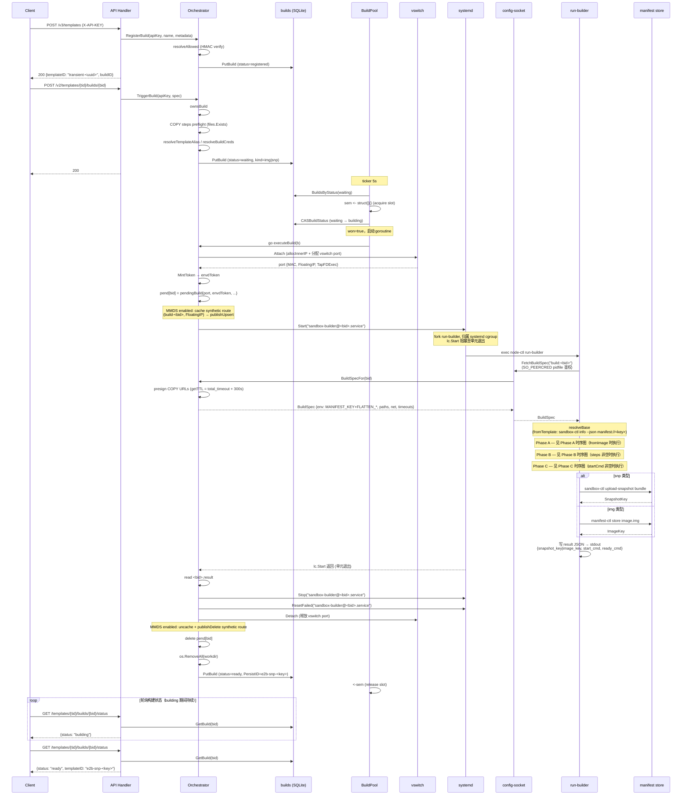
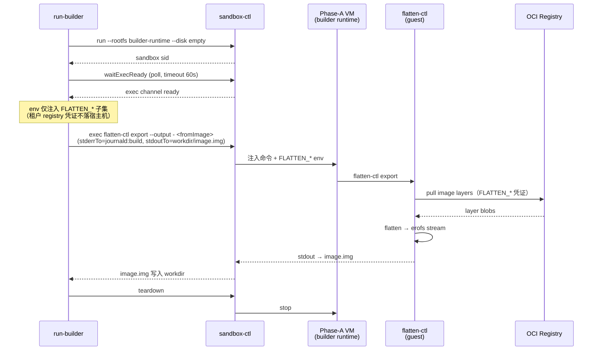
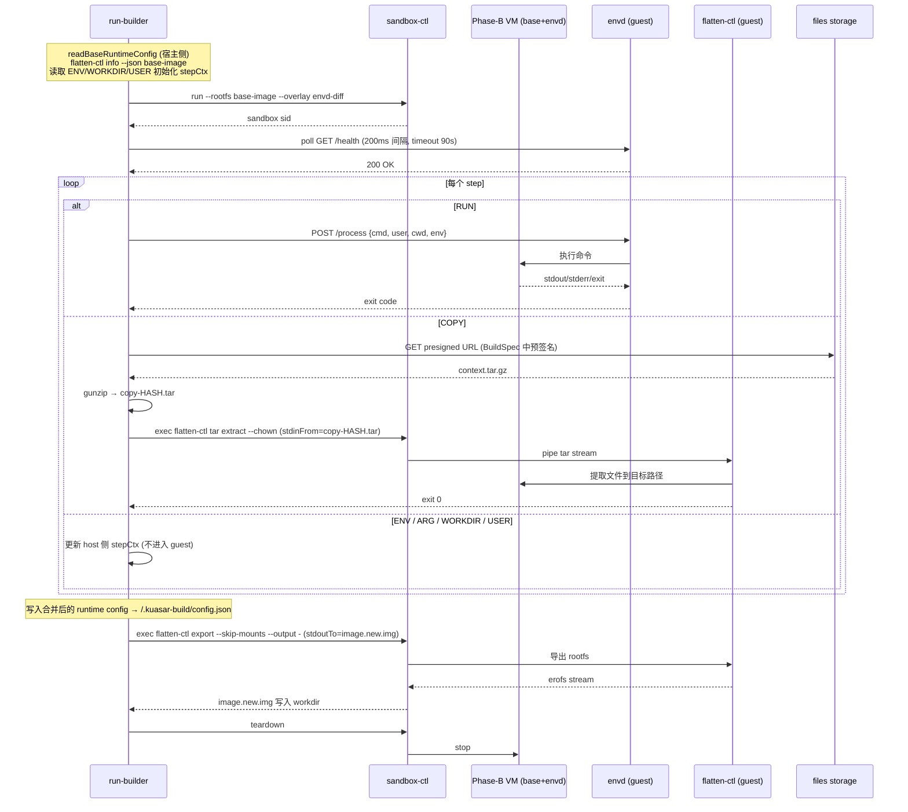
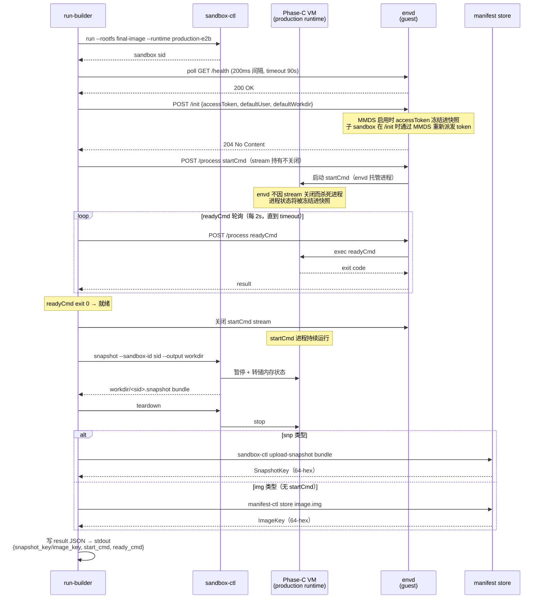
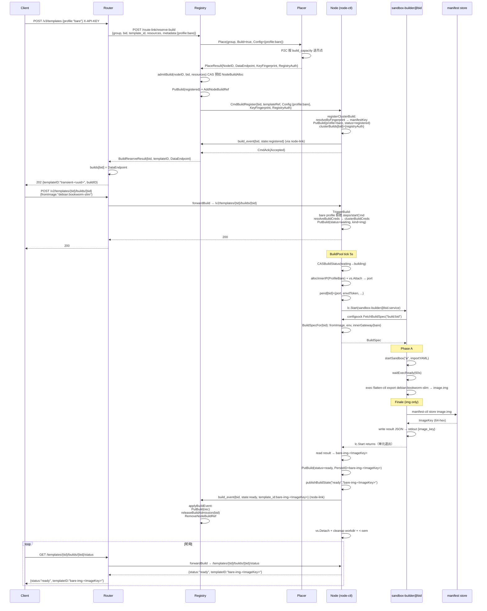

# FE-BUILD-01: node-ctl conductor 支持沙箱快照生命周期管理

## 1. 需求概述

sandbox 启动依赖两种制品：**img**（镜像）和 **snp**（快照）。

- **img**：OCI 镜像通过 flatten-ctl 扁平化后存入 manifest store，sandbox 从该 erofs 镜像冷启动。
- **snp**：包含冻结内存状态的快照，sandbox 可直接 resume，跳过冷启动和进程初始化。

制品通过三条路径产出，均经由构建 pipeline（RegisterBuild → TriggerBuild → BuildPool 调度）：

- **OCI 基础镜像展平**（Phase A）：将 OCI 镜像在 builder sandbox 内通过 `flatten-ctl export` 扁平化为 EROFS，上传 manifest store，产出 `<profile>-img-<key>`。支持 e2b 和 bare profile（bare 待支持，见 §4.9.5）。
- **自定义构建展平镜像**（Phase A + B）：在 Phase A 基础上，在 builder sandbox 内执行 RUN / COPY / ENV 等构建步骤后再次 flatten，产出含自定义内容的 `e2b-img-<key>`。仅支持 e2b profile（Phase B 依赖 envd）。
- **内存快照**（Phase A/B + C）：在展平镜像基础上冷启动 production sandbox，通过 envd 执行 `startCmd` 并等待 `readyCmd` 就绪，采集内存快照上传，产出 `e2b-snp-<key>`。仅支持 e2b profile（Phase C 依赖 envd）。

本特性在 `node-ctl conductor`（主编排进程）中实现完整的 template 生命周期管理，涵盖注册（RegisterBuild）、触发构建（TriggerBuild）、三阶段构建调度（BuildPool），到发布（ready PersistID）、列举（ListTemplates）、TTL 老化（TemplateGC）的全链路。目标是在不引入额外服务进程的情况下，让单节点 `node-ctl conductor` 具备 e2b 兼容的 template 全生命周期能力。

---

## 2. 需求分析

### 2.1 Goals & Non-Goals

**Goals**

| 目标 | 验收方法 |
|------|---------|
| node-ctl API 可完整完成 img 和 snp 类型的构建 | `RegisterBuild` + `TriggerBuild` 后，`GET .../status` 最终返回 `ready` 且 PersistID 可用于创建 sandbox |
| 构建过程复用 sandbox 网络槽（vswitch slot），无需为 builder 额外申请独立网络资源 | 三个阶段 sandbox 共享同一 vswitch port，构建结束后端口释放 |
| template 构建过程在独立的 systemd oneshot 单元内运行，cgroup 隔离，不占用编排主进程 goroutine | `sandbox-builder@<bid>.service` 出现在 `systemctl list-units` 输出中，构建结束后自动清理 |
| manifest key 等敏感信息通过 config-socket 传递，不落盘 | BuildSpec 中 `MANIFEST_KEY` 和 `FLATTEN_REGISTRY_*` 仅在 config-socket 会话内传输 |
| 支持 fromImage（OCI 基础镜像）和 fromTemplate（基于已有快照继承）两种构建源 | 两种路径均可走通，fromTemplate 能正确继承 `start_cmd`/`ready_cmd` 和 overlay 链 |
| 支持 RUN / ENV / ARG / WORKDIR / USER / COPY 六种构建步骤 | 每种步骤类型可正确执行，COPY 需 files_storage 配置 |
| bare profile sandbox 可通过 API 全流程产出可复用基础镜像 | Phase A build 产出 `bare-img-<key>`（待支持，见 §4.9.5），可被后续 `POST /sandboxes` 直接引用冷启动 |

**Non-Goals**

- 多节点分布式构建（当前在单 node-ctl 进程内完成）
- 构建镜像层缓存（无 layer cache，每次全量构建）
- COPY 步骤在未配置 files_storage 时的降级支持
- builder 单元跨节点迁移或抢占调度

### 2.2 交付范围

- `internal/orch/build.go`：RegisterBuild / TriggerBuild / BuildPool / executeBuild / runBuildUnit / BuildSpecFor
- `internal/builder/`：builder.go（pipeline 驱动）、import_steps.go（Phase A/B）、template.go（Phase C + finale 上传）、sandbox.go（phaseSandbox 抽象）
- `cmd/node-ctl/run_builder.go`：`run-builder` 子命令，systemd 单元 ExecStart
- `internal/configsock/server.go`：`PathTaskBuildSpec`、`BuildSpec`、`BuildStep`、`BuildPaths`、`BuildNet`、`BuildTimeouts` 数据结构
- `internal/types/build.go`：`Build`、`BuildState`、`TemplateStep`、`BuildState.SDKStatus()` 状态映射
- `internal/orch/migrate.go`：`ExportSandbox`（bare profile pause + export 路径，文档记录，无代码改动）
- `sandbox-accelerator/cmd/flatten-ctl`：`export --upload`（bare img 基础镜像预置，Phase A bare build 待支持前的临时替代，无代码改动）
- `internal/orch/build.go`（待支持）：`newRegisteredBuild` / `runBuildUnit` / `BuildSpecFor` 三处 `ProfileE2B` 硬编码参数化，支持 bare profile Phase A img build（见 §4.9.5）

### 2.3 友商分析

| 对比项 | e2b 原生（fly.io hosted） | 本方案 |
|--------|--------------------------|--------|
| 构建执行环境 | Nomad job（独立容器） | systemd oneshot 单元（同节点，复用 vswitch slot） |
| 构建阶段数 | 3（import/steps/template） | 3，与 e2b 一致 |
| 敏感信息传递 | 环境变量注入（容器 env） | config-socket SO_PEERCRED 鉴权，仅内存传输 |
| 构建并发控制 | Nomad 资源约束 | BuilderMaxConcurrent 计数信号量 |
| 构建结果存储 | GCS/S3 manifest store | manifest store（本地或远端可配置） |
| 跨节点构建 | 支持（Nomad 调度） | 不支持（单节点内） |

### 2.4 需求约束

1. **manifest_config 必须配置**：构建的 finale 阶段（upload image / upload-snapshot）依赖 manifest store，节点必须有可达的 manifest store 配置。
2. **vswitch 必须可用**：template 构建需要分配网络槽，`sandbox.network.switch` 必须已就绪。
3. **COPY 步骤依赖 files_storage**：若 template 包含 COPY 步骤，需在 config 中配置 files_storage（对象存储），否则在 TriggerBuild 时提前失败。
4. **systemd 版本要求**：`sandbox-builder@.service` 为 Type=oneshot 单元，需要 systemd >= 235（支持 TASK_CONFIG_SOCKET 等环境变量注入模板）。
5. **fromTemplate 仅支持 manifest:// 引用的已上传快照**：本地 CheckpointLocal 快照无法作为 fromTemplate 基础（overlay 链要求每一层均为 `manifest://` ref）。

---

## 3. 解决方案

### 3.1 User Stories

#### Story 1：租户发布基础镜像模板（img 类型）

> 作为一个平台租户，我想要通过 OCI 镜像地址构建一个 template，以便于后续快速从该镜像冷启动 sandbox，而不必每次拉取镜像。

流程：
1. `POST /v3/templates` → 分配 transient templateID + buildID，状态 `registered`
2. `POST /v2/templates/{tid}/builds/{bid}`（无 startCmd）→ 状态变为 `waiting`，Kind 推断为 `img`
3. BuildPool tick 调度 → 状态变为 `building`，启动 `sandbox-builder@<bid>.service`
4. Phase A：在 builder-runtime sandbox 内 `flatten-ctl export <OCI-image>` → `image.img`
5. Finale：`manifest-ctl store image.img` → 64-hex ImageKey
6. PersistID 设为 `e2b-img-<ImageKey>`，状态变为 `ready`
7. 租户通过 `GET /templates/{tid}/builds/{bid}/status` 轮询到 `ready`

#### Story 2：租户构建带启动进程快照的 template（snp 类型）

> 作为一个平台租户，我想要构建一个预启动了 HTTP 服务进程的 template 快照，以便于从该快照 fork 出的 sandbox 可以直接服务请求，避免冷启动延迟。

流程：
1. 注册 + 触发（含 `startCmd` 和 `readyCmd`）→ Kind 推断为 `snp`
2. Phase A/B：（可选）拉镜像、执行 RUN 步骤
3. Phase C：在 production-runtime sandbox 内通过 envd 启动 `startCmd`，`readyCmd` 2s 轮询直到 exit 0，然后 `sandbox-ctl snapshot` 写 bundle
4. Finale：`sandbox-ctl upload-snapshot` → SnapshotKey，PersistID = `e2b-snp-<SnapshotKey>`

#### Story 3：租户基于已有快照增量构建（fromTemplate）

> 作为一个平台租户，我想要在已有 template 的基础上叠加新的 RUN 步骤并生成新快照，以便于版本化管理沙箱运行时环境。

流程：
1. TriggerBuild 携带 `fromTemplate=<persistID>`，Pipeline 的 `resolveBase` 调用 `sandbox-ctl info --json manifest://<key>` 读取 `BaseRef`、`Overlay` 链及 `e2b.start_cmd`/`e2b.ready_cmd` 元数据
2. Phase B 以 fromTemplate 的镜像为 base，在其 overlay 之上执行 RUN 步骤，导出新 image.img
3. Phase C 以新镜像冷启动，执行 startCmd，快照后上传

#### Story 4：运维人员控制构建并发度

> 作为一个平台运维人员，我想要限制节点上同时执行的构建数量，以便于防止大量并发构建耗尽节点资源。

通过配置 `builder.max_concurrent`（默认建议 2），BuildPool 使用计数信号量（`chan struct{}`）控制并发上限；超出上限的构建在 `waiting` 状态队列中等待下一个 tick（默认 5s）。

#### Story 5：过期 template 自动老化回收

> 作为一个平台运维人员，我想要让长期未使用的 template 自动过期，以便于控制 builds 表和 manifest store 的增长，避免无限累积历史版本。

流程：
1. 后台 GC 任务定期扫描 builds 表，找出 `created_unix` 超过 TTL 阈值且状态为 `ready` 或 `error` 的记录
2. 将过期记录从 builds 表中删除
3. manifest store 中对应的 image/snapshot 内容由独立的 manifest GC 清理（按引用计数或孤儿扫描）

约束：
- **不提供租户侧删除接口**，template 生命周期完全由 TTL 策略控制
- 正在被 sandbox 使用的快照内容（manifest store 层）不受 builds 表记录删除影响；sandbox 运行期间仍可访问快照
- 若 template 记录被 GC 后，仍以该 persist id 发起 fromTemplate 构建，TriggerBuild 报 404

#### Story 6：通过 API 全流程产出 bare profile 基础镜像

> 作为一个平台运维人员，我想要通过纯 API 调用，将一个 OCI 镜像展平为 bare 基础镜像，以便后续从该镜像冷启动 bare sandbox，且全程无需登录节点执行命令行。

1. `POST /v3/templates {"profile":"bare"}` → 分配 bare templateID + buildID，Kind=img
2. `POST /v2/templates/{tid}/builds/{bid} {"fromImage":"<oci-image-ref>"}` → 无 startCmd、无 steps → 触发 Phase A：builder 沙箱内执行 `flatten-ctl export` 展平 OCI 镜像，产出 `bare-img-<key>`
3. `GET /templates/{tid}/builds/{bid}/status` 轮询至 `ready`，获取 `templateID: "bare-img-<key>"`
4. `POST /sandboxes {"templateID":"bare-img-<key>"}` → 验证可从展平镜像冷启动 bare sandbox（无 envd）

验收：执行步骤 1–4，步骤 4 的 sandbox 成功冷启动且无 envd；全程通过 API 完成，无需 SSH 到节点。

> **当前实现状态**：步骤 1–3（Phase A bare build）尚未实现，`newRegisteredBuild`、`runBuildUnit`、`BuildSpecFor` 三处硬编码 `ProfileE2B`；Phase A 本身不依赖 envd，技术可行，详见 §3.4 约束 6 与 §4.9.5。临时替代：用宿主机执行 `flatten-ctl export --upload` 代替步骤 1–3（参见 §4.9.0），步骤 4 不变。

### 3.2 架构影响分析

- **无新服务进程**：template 生命周期管理完全在现有 `node-ctl conductor` 框架内，通过 systemd 单元隔离 builder 子进程。
- **config-socket 扩展**：在原有 `LaunchSpec`（`PathTaskLaunchSpec`）通道旁增加 `BuildSpec`（`PathTaskBuildSpec`）通道，协议兼容，不影响已有 sandbox runner。
- **vswitch 资源影响**：构建期间占用一个 vswitch port，与 sandbox 共享池，需在节点容量规划中考虑在建 template 数量（= `builder.max_concurrent`）。
- **存储依赖**：新增 manifest store 写入路径（`manifest-ctl store` / `sandbox-ctl upload-snapshot`），生产部署需保证 manifest store 可达且有足够吞吐。

### 3.3 功能规格

| 规格项 | 说明 |
|--------|------|
| 支持构建步骤类型 | RUN、ENV、ARG、WORKDIR、USER、COPY/ADD |
| 构建类型 | img（仅镜像）、snp（快照）；触发时 `startCmd` 非空或使用 `fromTemplate` 则 kind 暂定 snp，最终以 pipeline 实际产出为准（fromTemplate 可继承基础模板的 startCmd） |
| 构建源 | fromImage（OCI ref）、fromTemplate（manifest:// persist id） |
| 构建并发上限 | `builder.max_concurrent`，默认无限制（= 0）需显式配置 |
| 默认超时 | pull: 300s，单步: 120s，ready: 120s，total: 1800s（均可配置） |
| 凭证优先级 | pullToken > regUser/regPass > clusterAuth > 租户默认（registry_auth_enc） |
| PersistID 格式 | `<profile>-<kind>-<64hex-key>`，如 `e2b-snp-<key>` |
| SDK 状态映射 | registered/waiting/building → "building"；ready → "ready"；error → "error" |
| bare profile 基础镜像创建 | build pipeline Phase A 产出 `bare-img-<key>`（待支持，见 §4.9.5），写 builds 表，可直接用于 `POST /sandboxes` 冷启动 |
| template 老化回收 | TTL 到期后由后台 GC 删除 builds 表记录；不提供租户侧删除接口；manifest store 内容由独立 GC 清理 |

### 3.4 风险及设计约束

1. **构建 sandbox 共用网络槽**：三阶段顺序复用同一 vswitch port，tapfd 通过 `TapFDExec` 重新拉取队列 fd。若中间阶段异常退出，下一阶段 sandbox 仍能获得同一个 port，但需确保上一个 sandbox 进程已完全终止。
2. **result 文件时序**：`o.lc.Start(unit)` 在 Type=oneshot 单元退出后才返回，随后读取 `<bid>.result`；若单元因 OOM/SIGKILL 崩溃（非正常 exit），result 文件可能不存在，此时 startErr != nil 且 readErr != nil，编排器将其归类为基础设施错误。
3. **MMDS synthetic route 泄漏**：若 `runBuildUnit` 的 defer 未执行（进程信号），synthetic route 行（build-<bid>）将残留在内存路由表，可被数据面误路由。需在 conductor 启动时的 reaper 阶段清理孤儿 build route。
4. **fromTemplate overlay 链长度**：多级 fromTemplate 继承会形成 `manifest://k1:k2:k3:...` 的多 key ref，每次 boot 都需按顺序拉取所有层；建议在 TriggerBuild 阶段对链长设置上限（建议 ≤ 8 层）。
5. **敏感信息生命周期**：`BuildSpec.Env["MANIFEST_KEY"]` 仅在 config-socket 会话期间在内存中，`pend` map 在 `runBuildUnit` 返回前持有明文密钥，属于正常设计但需确保 `pend` 不被日志序列化输出。
6. **Phase A bare profile 支持缺口**：`newRegisteredBuild` 硬编码 `Profile: types.ProfileE2B`，`runBuildUnit` 的 `allocInnerIP` 和 `BuildSpecFor` 的 `innerGateway` 也硬编码为 e2b，导致 bare profile 无法走 Phase A build 路径。Story 6 描述的 API 全流程依赖消除这三处硬编码，详见 §4.9.5。Phase A 本身仅使用 `sandbox-ctl exec` 驱动 `flatten-ctl export`，不依赖 envd，技术上可行。

### 3.5 可选的替代方案

**方案 B：独立 builder 进程**（已排除）

将 template 生命周期管理中的构建部分拆出为独立的 `node-ctl builder` 守护进程，通过 gRPC 与 `conductor` 通信。优点是进程隔离更彻底；缺点是增加进程数、部署复杂度、vswitch slot 分配需跨进程协调。当前方案通过 systemd 单元 cgroup 隔离已满足安全边界，不值得增加部署复杂度。

---

## 4. 详细设计

### 4.1 template 生命周期状态机

```
[API 注册]
    │ POST /v3/templates
    ▼
registered ──► waiting ──► building ──► ready ──► (TTL 到期)
    │                         │                        │
    │ (注册 TTL 到期)          └──────────► error ──► (TTL 到期)
    │                                                   │
    └───────────────────────────────────────────────────┘
                                                        │
                                                   [GC 删除记录]
```

| 状态 | 触发条件 | SDK 可见状态 |
|------|---------|-------------|
| `registered` | RegisterBuild 成功写库 | "building" |
| `waiting` | TriggerBuild 完成校验并写库 | "building" |
| `building` | BuildPool CAS 抢占成功，goroutine 启动 | "building" |
| `ready` | executeBuild 上传成功，PersistID 写入 | "ready" |
| `error` | 构建失败或基础设施错误 | "error" |
| （记录删除） | GC 扫描 TTL 到期，从 builds 表删除 | N/A |

### 4.2 快照创建路径 A：构建 pipeline（e2b profile；bare img-only 待支持，见 §4.9.5）

```
node-ctl conductor
│
├─ API: POST /v3/templates
│   └─ newRegisteredBuild
│       ├─ resolveAllowed (manifest key HMAC verify)
│       ├─ uuid.NewV7 → templateID (transient-), buildID
│       └─ PutBuild (status=registered, kind=img)
│
├─ API: POST /v2/templates/{tid}/builds/{bid}
│   └─ TriggerBuild
│       ├─ ownsBuild (key ownership check)
│       ├─ COPY steps preflight (files_storage.Exists)
│       ├─ resolveTemplateAlias → fromTemplate persist id
│       ├─ resolveBuildCreds → RegistryAuth (encrypted)
│       └─ PutBuild (status=waiting, kind=img|snp provisional)
│
├─ BuildPool (background, ticker 5s)
│   └─ CASBuildStatus waiting→building
│       └─ go executeBuild(b)
│           └─ runBuildUnit(b)
│               ├─ mkdir <RunRoot>/<bid>          # workdir
│               ├─ allocInnerIP (e2b profile)
│               ├─ vs.Attach → port (MAC, FloatingIP)  # ONE slot
│               ├─ keys.MintToken → envdToken
│               ├─ pend[bid] = pendingBuild{...}
│               ├─ [mmds] cache + publishUpsert (synthetic route)
│               ├─ lc.Start("sandbox-builder@<bid>.service")
│               │   └─ run-builder (ExecStart)
│               │       ├─ configsock.FetchBuildSpec("build:<bid>")
│               │       │   └─ BuildSpecFor (node-ctl side)
│               │       │       ├─ env: MANIFEST_KEY, FLATTEN_*
│               │       │       ├─ presign COPY URLs
│               │       │       └─ phase-C capacity from template metadata
│               │       └─ builder.Run(spec)
│               │           ├─ resolveBase (fromTemplate: sandbox-ctl info --json)
│               │           ├─ [fromImage] phaseImport (Phase A)
│               │           │   └─ startSandbox("a") → flatten-ctl export → image.img
│               │           ├─ [steps] phaseSteps (Phase B)
│               │           │   ├─ startSandbox("b") w/ envd
│               │           │   ├─ RUN: envdExec.run(...)
│               │           │   ├─ COPY: fetchCopyContext + sandbox-ctl exec flatten-ctl tar extract
│               │           │   └─ flatten-ctl export → image.new.img
│               │           ├─ [startCmd] phaseTemplate (Phase C)
│               │           │   ├─ startSandbox("c", production-runtime)
│               │           │   ├─ waitEnvd + envdInit (MMDS token)
│               │           │   ├─ envdExec.start(startCmd) [held]
│               │           │   ├─ readyCmd poll (2s interval)
│               │           │   └─ sandbox-ctl snapshot → bundle
│               │           └─ finale
│               │               ├─ [snp] sandbox-ctl upload-snapshot → SnapshotKey
│               │               └─ [img] manifest-ctl store → ImageKey
│               │   stdout → <bid>.result JSON
│               ├─ read <bid>.result
│               └─ vs.Detach(port)  # slot released
│           └─ PutBuild (status=ready|error, PersistID=<profile>-<kind>-<key>)
│
└─ API: GET /templates/{tid}/builds/{bid}/status
    └─ BuildStatus → Build.Status.SDKStatus()

TemplateGC (background, ticker template_gc_interval_sec)
    └─ gcBuilds(ctx)
        ├─ [template_ttl_sec > 0]
        │   cutoff := now - template_ttl_sec
        │   DeleteBuildsBefore(ctx, cutoff, ready, error)
        └─ regCutoff := now - registered_ttl_sec
            DeleteBuildsBefore(ctx, regCutoff, registered)
```

#### 总览时序



#### Phase A：镜像导入时序



#### Phase B：构建步骤时序



#### Phase C：模板快照时序



### 4.3 API 设计

#### 4.3.1 对外 API（e2b 兼容）

所有接口均要求 API Key 鉴权，二选一：
- `X-API-KEY: <api-key>`
- `Authorization: Bearer <api-key>`（e2b CLI 使用此形式）

---

**POST /v3/templates**

注册一个新构建，分配 templateID 和 buildID。

```
Request Headers:
  X-API-KEY: <api-key>                          # 必填（或 Authorization: Bearer <api-key>）
  X-Kuasar-Sandbox-Resource: <json>             # 可选，模板默认资源配置
                                                #   示例：{"cpu":2,"memory_mb":512}
  X-Kuasar-Sandbox-Network:  <json>             # 可选，模板默认网络配置
  X-Kuasar-Sandbox-Launch:   <json>             # 可选，模板默认启动配置
  X-Kuasar-Sandbox-Metadata: <json>             # 可选，模板自定义元数据

Request Body (JSON):
  {
    "name": "my-template",             # 可选，template 可读名称
    "tags": ["v1", "stable"],          # 可选，别名列表
    "cpuCount": 2,                     # 可选，与 X-Kuasar-Sandbox-Resource 二选一
    "memoryMB": 512,                   # 可选，与 X-Kuasar-Sandbox-Resource 二选一
    "profile": "bare"                  # 可选，默认 "e2b"；"bare" 仅支持 img-only Phase A（待实现，见 §4.9.5）
  }

Response 200:
  {
    "templateID": "transient-<uuidv7>",
    "buildID": "<uuidv7>",
    "sdkVersion": "..."
  }
```

---

**POST /v2/templates/{templateID}/builds/{buildID}**

触发构建，提交构建规格。

```
Request Headers:
  X-API-KEY: <api-key>                          # 必填（或 Authorization: Bearer <api-key>）
  X-Kuasar-Pull-Token: <pull-token>             # 可选，私有 registry 拉取凭证（manifest-key 加密令牌）
  X-Kuasar-Sandbox-Resource: <json>             # 可选，触发时覆盖注册时的资源配置
  X-Kuasar-Sandbox-Network:  <json>             # 可选，触发时覆盖网络配置

Request Body (JSON):
  {
    "fromImage": "python:3.11-slim",                          # 与 fromTemplate 二选一
    "fromTemplate": "e2b-snp-<key>",                         # 与 fromImage 二选一
    "fromImageRegistry": {"username": "u", "password": "p"}, # 可选，明文 registry 凭证
    "startCmd": "python server.py",                           # 非空时构建 snp 类型
    "readyCmd": "curl localhost:8000",                        # 就绪探针
    "steps": [
      {"type": "RUN",  "args": ["pip install flask"]},
      {"type": "ENV",  "args": ["PORT=8000"]},
      {"type": "COPY", "args": ["app/", "/app/"], "filesHash": "<sha256>"}
    ],
    "cpuCount": 2,
    "memoryMB": 512
  }

Response 200: {}
Response 400: { "message": "COPY context <hash> not uploaded" }
Response 404: (templateID/buildID 不存在或非本人所有)
```

---

**GET /templates/{templateID}/builds/{buildID}/status**

轮询构建状态。

```
Request Headers:
  X-API-KEY: <api-key>                          # 必填（或 Authorization: Bearer <api-key>）

Response 200:
  {
    "status": "building" | "ready" | "error",
    "templateID": "<persistID>",      # ready 时填充（e2b-snp-<key>、e2b-img-<key>、bare-img-<key> 等）
    "buildID": "<buildID>",
    "reason": { "message": "..." }    # error 时填充
  }
```

---

**GET /templates**

列举租户所有 ready 状态的 templates。

```
Request Headers:
  X-API-KEY: <api-key>                          # 必填（或 Authorization: Bearer <api-key>）

Response 200: [ { "templateID": "...", "name": "...", ... }, ... ]
```

#### 4.3.2 内部 config-socket API（`/internal/task/buildspec`）

`run-builder` 通过 config-socket（UDS，h2c）发起，SO_PEERCRED 以 pidfile 鉴权。

```go
// Request
type Request struct {
    ConfigID string `json:"config_id"` // "build:<bid>"
    Version  int    `json:"version"`
}

// Response
type BuildSpec struct {
    BuildID          string
    Workdir          string
    FromImage        string
    FromTemplate     string   // 64-hex manifest key of base template
    FromTemplateKind string   // "img" | "snp"
    Steps            []BuildStep
    StartCmd         string
    ReadyCmd         string
    Env              map[string]string  // MANIFEST_KEY + FLATTEN_REGISTRY_*
    Paths            BuildPaths
    Net              BuildNet
    VCPU             int
    Memory           string
    MMDSEnabled      bool
    EnvdToken        string   // Phase C envd /init token
    Insecure         bool
    Platform         string
    Timeouts         BuildTimeouts
}
```

### 4.4 数据库设计

构建记录复用 `builds` 表，同时作为 template 注册表（无单独 templates 表）。

#### builds 表

| 字段 | 类型 | 说明 |
|------|------|------|
| `build_id` | TEXT PK | uuidv7 |
| `template_id` | TEXT | transient-<uuidv7>（注册时），PersistID 写入 names/aliases |
| `persist_id` | TEXT | `<profile>-<kind>-<key>`，构建 ready 后填充 |
| `manifest_key` | TEXT | 64-hex 或 AES-256 加密后存储（encryption_key 配置时） |
| `profile` | TEXT | "e2b" \| "bare" |
| `kind` | TEXT | "img" \| "snp"，构建完成后以实际产出为准 |
| `from_image` | TEXT | OCI 镜像 URI |
| `from_template` | TEXT | 基础快照 persist id |
| `registry_auth_enc` | TEXT | registry 凭证 JSON（AES-256 加密） |
| `start_cmd` | TEXT | snp 模板的启动命令 |
| `ready_cmd` | TEXT | 就绪探针命令 |
| `steps_json` | TEXT | `[]TemplateStep` JSON |
| `status` | TEXT | registered \| waiting \| building \| ready \| error |
| `reason` | TEXT | 错误详情 |
| `names_json` | TEXT | JSON array，含 persist_id（ready 后） |
| `aliases_json` | TEXT | JSON array，含 persist_id（ready 后） |
| `metadata_json` | TEXT | sandbox 默认配置（kuasar-sandbox.* keys） |
| `created_unix` | INTEGER | 创建时间戳 |

索引：
- `(status)` — BuildPool 扫描 waiting 构建
- `(manifest_key)` — 按租户过滤 ready templates（ListTemplates）
- `(status, created_unix)` — GC 扫描按状态 + 时间过滤（覆盖索引，避免全表扫描）

**GC 删除语句**（`DeleteBuildsBefore`）：

```sql
DELETE FROM builds
WHERE status IN (?, ...)
  AND created_unix < ?
```

每轮 GC 执行两次：一次清理 `ready`/`error`（按 `template_ttl_sec`），一次清理 `registered`（按 `registered_ttl_sec`）。

### 4.5 可观测性设计

#### 4.5.1 日志

构建进度日志通过 journald `SYSLOG_IDENTIFIER=build` 写入，以 `sandbox-builder@<bid>` 为单元标识，可通过 `journalctl -u sandbox-builder@<bid> SYSLOG_IDENTIFIER=build` 查看：

| 日志标签 | 内容 | SDK 可见 |
|---------|------|---------|
| `build` | 构建里程碑（phase 开始/结束、RUN 输出、上传进度） | 是（通过 GET .../logs streaming） |
| `console` | guest kernel dmesg | 否（host-only） |
| `sandbox` | 运行时 sandbox app stdio | 否（host-only） |

编排器侧日志（`o.log`）记录：
- `build failed` (warn)：`bid`, `err` 字段
- `build ready` (info)：`bid`, `template` (persistID) 字段

#### 4.5.2 事件

`o.publishBuildState(bid, status, persistID, reason)` 将构建状态变更推送到 routesync event bus，供 cluster 模式下的 registry 感知构建完成。

#### 4.5.3 指标（建议新增）

| 指标名 | 类型 | 说明 |
|--------|------|------|
| `build_total{status="ready|error"}` | Counter | 构建完成/失败次数 |
| `build_duration_seconds{phase="import|steps|template|total"}` | Histogram | 各阶段耗时 |
| `build_pool_waiting` | Gauge | 当前 waiting 队列深度 |
| `build_pool_building` | Gauge | 当前 building 数量 |

### 4.6 配置项设计

`node-ctl.yaml` 中的 `builder` 节：

```yaml
builder:
  max_concurrent: 2          # 最大并发构建数（0=不限）
  vcpu: 2                    # 构建 sandbox 默认 vCPU（Phase A/B/C 共用）
  memory: "4GiB"             # 构建 sandbox 内存
  runtime_builder: /opt/kuasar/share/sandbox/rootfs-builder.erofs  # Phase A/B runtime
  diff_template: /opt/kuasar/share/sandbox/overlay-builder.diff    # Phase A/B overlay diff
  pull_timeout_sec: 300      # 镜像拉取超时
  step_timeout_sec: 120      # 单个 RUN 步骤超时
  ready_timeout_sec: 120     # readyCmd 总超时
  total_timeout_sec: 1800    # 整个构建超时
  insecure_registry: false   # 允许 HTTP registry
  platform: ""               # OCI 平台过滤（如 linux/amd64）
  image_uri_mask: ""         # 镜像 URI 掩码模板，用于构建日志脱敏
                             # 如 registry.example.com/{templateID}:{buildID}
  template_ttl_sec: 0        # template 记录 TTL（秒）；0 = 不过期
  template_gc_interval_sec: 3600  # GC 扫描间隔；默认 1h
  registered_ttl_sec: 86400  # 未触发的 registered 记录 TTL；默认 24h
```

### 4.7 template 老化回收详细设计

#### 4.7.1 GC 触发机制

`node-ctl conductor` 启动时启动后台 goroutine `TemplateGC`，以 `builder.template_gc_interval_sec`（默认 1h）为周期定时扫描，逻辑如下：

```
TemplateGC(ctx, interval)
    ticker := time.NewTicker(interval)
    for tick:
        gcBuilds(ctx)
```

`builder.template_ttl_sec = 0` 时跳过 `ready`/`error` 的清理（永不过期），但 `registered` 的清理仍按 `registered_ttl_sec` 无条件执行，防止未触发的悬空记录堆积。

#### 4.7.2 扫描与删除策略

**可 GC 的状态与 TTL**

| 状态 | TTL 配置项 | 说明 |
|------|-----------|------|
| `ready` | `template_ttl_sec` | 正式发布的 template，TTL = 0 时永不过期 |
| `error` | `template_ttl_sec` | 构建失败记录，与 ready 共享同一 TTL |
| `registered` | `registered_ttl_sec` | 注册后未触发构建的悬空记录，默认 24h |

**跳过的状态**：`waiting`、`building` 状态的记录正在进行中，GC 不触碰，避免与 BuildPool 竞争。

每轮 GC 执行两次删除：一次清理 `ready`/`error`（按 `template_ttl_sec`），一次清理 `registered`（按 `registered_ttl_sec`）。详细流程见 §4.2，SQL 见 §4.4。

#### 4.7.3 manifest store GC

builds 表记录删除后，manifest store 中对应的 image/snapshot 内容成为孤儿对象，由独立的 manifest GC 流程负责清理（按引用计数或孤儿扫描），不在本特性范围内。

**安全边界**：运行中的 sandbox 直接持有快照的 manifest key，不依赖 builds 表记录；builds 表记录删除不影响已创建 sandbox 的存活。

#### 4.7.4 fromTemplate 引用悬空

若 template A 已被 GC 删除，但租户尝试以其 persist id 作为 `fromTemplate` 触发新构建：

- `TriggerBuild` 中 `resolveTemplateAlias` 找不到记录，返回 `404`
- 错误信息：`fromTemplate "<persistID>": not a known template`

不提供引用保护（即不阻止 GC 删除仍被 fromTemplate 引用的 template），依赖租户自行管理依赖链。

#### 4.7.5 可观测性

新增 GC 相关日志和指标：

**日志**（`o.log`）：
- `template gc` (info)：`deleted=N`、`elapsed` 字段，每轮扫描结束后输出

**指标**（建议新增）：

| 指标名 | 类型 | 说明 |
|--------|------|------|
| `template_gc_deleted_total{status="ready\|error\|registered"}` | Counter | 各状态下累计删除的 template 记录数 |
| `template_gc_duration_seconds` | Histogram | 每轮 GC 扫描耗时 |

### 4.8 Build Pool 详细设计

#### 4.8.1 并发控制

BuildPool 是 node-ctl conductor 内的后台 goroutine，以固定 interval（默认 5s）tick，每轮扫描 `waiting` 状态的构建并尝试调度：

```
BuildPool(ctx, interval=5s)
│
├── sem = make(chan struct{}, builder.max_concurrent)   // 计数信号量
└── tick:
    ├── waiting = st.BuildsByStatus(ctx, waiting)
    └── for b in waiting:
            select sem <- struct{}{}:                   // 抢占槽位
                won = CASBuildStatus(waiting → building) // DB 层防重复认领
                if !won: <-sem; continue                // 其他实例已认领，退回槽位
                go executeBuild(b):
                    lc.Start(unit)                      // 阻塞至单元退出
                    <-sem                               // 释放槽位
            default:
                break                                   // 池满，跳过本轮剩余
```

两个控制点的分工：

| 控制点 | 作用 |
|--------|------|
| 计数信号量 `sem` | 限制同时运行的 `sandbox-builder@<bid>` 单元数 ≤ `builder.max_concurrent` |
| `CASBuildStatus` | 防止多实例（重启恢复场景）或同一 tick 内并发 goroutine 重复认领同一构建 |

`lc.Start(unit)` 在 Type=oneshot 单元退出前阻塞，因此信号量槽位覆盖了构建的完整执行周期，不会出现槽位提前释放导致超发的情况。

#### 4.8.2 run-builder 进程资源控制

run-builder 由 systemd 启动，不是 node-ctl 的直接子进程，进程树如下：

```
systemd (PID 1)
└── sandbox-builder@<bid>.service  cgroup: system.slice/sandbox-builder@<bid>.service
    └── node-ctl run-builder
        ├── sandbox-ctl run  (Phase A)   ← Firecracker 进程也在此 cgroup
        ├── sandbox-ctl run  (Phase B)   ← 顺序执行，同一时刻只有一个
        └── sandbox-ctl run  (Phase C)
```

资源控制分两层：

| 层 | 控制对象 | 机制 | 配置项 |
|----|---------|------|--------|
| systemd cgroup | run-builder 本身 + 所有子进程（含 Firecracker） | systemd 自动为每个单元建立独立 cgroup，单元退出后自动回收；当前未设置 `CPUQuota`/`MemoryMax`，宿主侧 run-builder 开销极小（IO 转发 + JSON 解析），无需限制 | 无 |
| Firecracker hypervisor | 每个阶段 microVM 的 vCPU / 内存 | BuildSpec 携带 `vcpu`/`memory`，各阶段启动时传入 Firecracker，由 hypervisor 在 VM 层强制执行 | `builder.vcpu` / `builder.memory` |

阶段 sandbox 顺序执行（Phase A 结束后 Phase B 才启动），因此同一构建单元内同一时刻只有一个 Firecracker 进程存活，vswitch slot 也只占用一个。

#### 4.8.3 node-ctl conductor 重启恢复

conductor 重启后，`pend` map 清空，正在运行的 `sandbox-builder@<bid>` 单元无法通过 config-socket 获取 BuildSpec，run-builder 退出并将构建置为 error。

重启后 BuildPool 扫描到 `building` 状态的残留记录时，当前版本**不自动重试**（CAS 无法从 building 迁移到 waiting），需运维手动将状态重置为 waiting 后由下一个 tick 重新调度。

### 4.9 快照创建路径 B：pause + export（bare profile）

#### 4.9.0 bare img 基础镜像预置（临时替代方案）

> **临时替代方案**：本节描述的宿主机 CLI 流程是 Story 6 Phase A build 尚未实现期间的替代手段（Phase A bare profile 支持缺口见 §3.4 约束 6 和 §4.9.5）。Phase A 实现后，`bare-img-<key>` 可通过 `POST /v3/templates` + `POST /v2/templates/{tid}/builds/{bid}` 的 API 流程产出，无需登录节点。本节仍适用于**从本地 rootfs 目录产出**（§4.9.0 下方第二种用法）或批量预置等无法通过 API 触发的场景。

bare sandbox 的启动依赖一个预先存入 manifest store 的 EROFS 基础镜像（`bare-img-<key>`）。该镜像由运维人员在宿主机上通过 `flatten-ctl export` 直接产出并上传：

**从 OCI 镜像产出**（最常见）：

```bash
flatten-ctl export <oci-image-ref> \
  --upload \
  --manifest-config <manifest-config.yaml>
# stdout 输出：<64hex-key>
# templateID = bare-img-<64hex-key>
```

**从本地 rootfs 目录产出**（定制内核或无法通过 OCI 分发的场景）：

```bash
flatten-ctl export <rootfs-dir> \
  --upload \
  --manifest-config <manifest-config.yaml> \
  [--runtime-config <oci-runtime-config.json>]   # 可选，附加 OCI 运行时配置
# stdout 输出：<64hex-key>
# templateID = bare-img-<64hex-key>
```

`flatten-ctl export --upload` 将 rootfs 打包成 EROFS、封装为 tarstream artifact，上传 manifest store 后在 stdout 输出 hex manifest key。租户加密密钥从 `--manifest-config` 配置文件读取（`manifest.key` 字段），也可通过 `MANIFEST_KEY=<32-byte-hex>` 环境变量覆盖。`bare-img-<key>` 即可作为后续 `POST /sandboxes` 的 `templateID`。

#### 4.9.1 适用场景

bare profile sandbox 没有 envd 守护进程，Phase B（RUN steps）和 Phase C（startCmd 快照）无法运行；但 Phase A img-only build 仅使用 `sandbox-ctl exec` 不依赖 envd，bare profile 可通过 build pipeline 产出 `bare-img-<key>`（见 §4.9.5，当前实现待支持）。

pause + export 路径（路径 B）用于将已初始化好的 bare sandbox 运行时状态固化为可复用的启动基准，适用场景：

- 基础系统镜像定制（在运行中的 sandbox 内安装软件包、写入配置文件）
- 有状态进程预热（提前启动长初始化进程，对外提供极速 resume 能力）
- e2b profile 的快速分叉（将已运行的 sandbox 状态固化为 fork 基准）

> 注：该路径同样适用于 e2b profile sandbox，但 e2b profile 更常用路径 A（构建 pipeline）。

#### 4.9.2 整体流程

```
Operator / Automation
│
├─ [前提：获取 bare-img-<key>，可通过 Phase A build API（见 §4.9.5）或宿主机 CLI（见 §4.9.0）产出]
│
├─ POST /sandboxes {"templateID": "bare-img-<key>"}
│   └─ Orch.CreateSandbox → 从 bare img 冷启动（profile=bare，无 envd）
│
├─ [在 sandbox 内完成初始化操作]
│   └─ 通过 vsock / 其他渠道执行，编排层不感知
│
├─ POST /sandboxes/{id}/pause
│   └─ Orch.pauseSandbox
│       ├─ CheckpointMode==local  → snapshotLocal → bundle 路径（节点绑定）
│       └─ CheckpointMode!=local  → snapshotRemote (--upload) → manifest://<key>
│       └─ [两路均执行] SetSnapshotRef / SetState(PAUSED) → DB
│       └─ [两路均执行] lc.Stop / lc.ResetFailed / vs.Detach
│
└─ POST /sandboxes/{id}/export {"toTemplate": true}
    └─ Orch.ExportSandbox(toTemplate=true)
        ├─ 若 SnapshotRef 不以 "manifest://" 开头（本地路径）
        │   ├─ promote() → sandbox-ctl upload-snapshot → manifest://<key>
        │   ├─ SetSnapshotRef(manifest://<key>) → DB（更新 sandbox 行）
        │   └─ os.RemoveAll(localBundleDir)（删除本地 bundle）
        ├─ 组装 persist id：bare-snp-<64hex-key>
        └─ 返回 {"result": "bare-snp-<key>"}（persist id 自描述，无需 builds 表记录；源 sandbox 行始终保留）
```

#### 4.9.3 时序图

```
Client           API            Orchestrator      sandbox-ctl    manifest store
  │               │                   │                │                │
  │  [前提：bare-img-<key> 已就绪（Phase A build API（§4.9.5）或宿主机 CLI（§4.9.0）产出）]
  │ POST /sandboxes {"templateID":"bare-img-<key>"}    │                │
  │──────────────>│                   │                │                │
  │               │ CreateSandbox     │                │                │
  │               │──────────────────>│                │                │
  │               │   从 bare img 冷启动（无 envd）    │                │
  │<──────────────│  {sandboxID}      │                │                │
  │  [operator initializes sandbox via vsock/API]      │                │
  │               │                   │                │                │
  │ POST /sandboxes/{id}/pause         │                │                │
  │──────────────>│                   │                │                │
  │               │ pauseSandbox()    │                │                │
  │               │──────────────────>│                │                │
  │               │                   │ snapshot --upload (remote mode) │
  │               │                   │──────────────────────>          │
  │               │                   │      (or --output, local mode)  │
  │               │                   │<──────────────────────          │
  │               │                   │  manifest://<key> OR local_path │
  │               │                   │ SetSnapshotRef / SetState(PAUSED) → DB(sandboxes)
  │               │                   │ lc.Stop / ResetFailed / vs.Detach
  │               │<──────────────────│                │                │
  │<──────────────│  204 No Content   │                │                │
  │               │                   │                │                │
  │ POST /sandboxes/{id}/export        │                │                │
  │ {"toTemplate":true}               │                │                │
  │──────────────>│                   │                │                │
  │               │ ExportSandbox     │                │                │
  │               │ (toTemplate=true) │                │                │
  │               │──────────────────>│                │                │
  │               │                   │ [if local] upload-snapshot      │
  │               │                   │──────────────────────>          │
  │               │                   │<──────────────────────          │
  │               │                   │         manifest://<key>        │
  │               │                   │ SetSnapshotRef(manifest://<key>) → DB(sandboxes)
  │               │                   │ os.RemoveAll(localBundleDir)    │
  │               │                   │ assemble persist id: bare-snp-<key>
  │               │<──────────────────│                │                │
  │<──────────────│ {"result":"bare-snp-<key>"} │      │                │
```

#### 4.9.4 与路径 A 的设计对比

| 维度 | 路径 A（构建 pipeline） | 路径 B（pause + export） |
|------|------------------------|-------------------------|
| 触发 API | `POST /v3/templates` + `POST /v2/templates/{tid}/builds/{bid}`（本特性新增） | `POST /sandboxes/{id}/pause` + `POST /sandboxes/{id}/export {"toTemplate":true}`（均为已有 API） |
| 依赖 envd | Phase B/C 依赖（RUN steps / startCmd/readyCmd）；Phase A img-only 仅用 `sandbox-ctl exec`，不依赖 envd | 否 |
| 适用 profile | e2b；bare img-only（Phase A）待支持，见 §4.9.5 | bare（主要）、e2b 亦可 |
| 构建状态机 | registered → waiting → building → ready/error | 无（export 成功即可直接使用） |
| builds 表 | RegisterBuild/TriggerBuild/executeBuild 逐步写入 | 不写 builds 表，persist id 自描述（`bare-snp-<key>`） |
| 失败重试 | 可重新 TriggerBuild | 需重新 pause + export |
| overlay 链继承 | 支持（fromTemplate manifest://k1:k2:k3） | 不支持（每次 export 产生全量快照） |
| 并发控制 | BuildPool 信号量 | 无（每次 export 是独立操作） |
| 构建后源 sandbox | 构建 sandbox 由 runBuildUnit 清理 | `toTemplate=true` 时源 sandbox 行**始终保留**（keepSource 仅在迁移 token 模式下生效） |

#### 4.9.5 设计缺口：Phase A bare profile 支持

bare profile 通过 API 全流程产出基础镜像（`bare-img-<key>`，见 §3.1 Story 6）依赖 bare profile 能走 Phase A build。Phase A 技术上不需要 envd——它通过 `sandbox-ctl exec` 在 builder 沙箱内运行 `flatten-ctl export`，`waitExecReady` 等待的是 sandbox-ctl launch server（vsock 5000），与 envd 无关。

当前阻塞点是三处硬编码 `ProfileE2B`：

| 位置 | 当前代码 | 需改为 |
|------|---------|--------|
| `orch/build.go` `newRegisteredBuild` | `Profile: types.ProfileE2B` | 从 API 请求参数读取 profile（默认 e2b） |
| `orch/build.go` `runBuildUnit` | `allocInnerIP(types.ProfileE2B, "")` | `allocInnerIP(b.Profile, "")` |
| `orch/build.go` `BuildSpecFor` | `innerGateway(types.ProfileE2B)` | `innerGateway(b.Profile)` |

消除上述三处硬编码后，bare profile 的 img-only build 路径即可走通，PersistID 将正确生成为 `bare-img-<key>`（`executeBuild` 中 `b.Profile` 传递到 `types.TemplateID{Profile: b.Profile, ...}.String()`，无需额外改动）。Phase B/C（RUN steps / startCmd）因依赖 envd 仍仅限 e2b profile，TriggerBuild 应在 bare profile 下拒绝携带 steps 或 startCmd 的请求。

---

## 4.10 集群模式 bare img Phase A 构建完整流程

### 4.10.1 概述

§4.2 描述的是 Client 直连单节点 node-ctl conductor 的构建路径。集群模式下，Client 连接的是
**router**，router 通过 route-link 向 **registry** 发起 `ReserveBuild`，registry 通过
**placer** 按 `build_capacity` 选节点、通过 **node-link** 下发 `CmdBuildRegister` 预配节点；
后续 TriggerBuild / 状态查询由 router 直接转发到节点数据面（`DataEndpoint`），构建状态变更
通过 node-link **build_event** 异步回报 registry（用于释放预扣资源）。

bare img Phase A 场景：`fromImage` 非空、无 `steps`、无 `startCmd`，构建仅执行 Phase A，
Finale 只产出 `bare-img-<key>`，整个流程不涉及 Phase B / Phase C。

### 4.10.2 与单节点模式的对比

| 维度 | 单节点（§4.2） | 集群（§4.10） |
|------|--------------|-------------|
| 客户端入口 | 直连 node-ctl API | Router 层（透明转发到目标节点） |
| 节点选择 | 固定（本机） | placer P2C 按 `build_capacity` 选节点，最多重试 2 次 |
| RegisterBuild | 节点写 builds 表 | router → registry `ReserveBuild` → `CmdBuildRegister` → 节点写 builds 表 |
| TriggerBuild | 节点直接处理 | router `forwardBuild` → 节点 DataEndpoint |
| 状态查询 | 节点直接返回 | router `forwardBuild`；router 重启后 `ResolveBuild` 恢复路由 |
| 状态回报 | 仅本地日志 | node-link `build_event` → registry（驱动 `admitBuild` 预扣释放） |
| 资源预扣 | BuildPool 信号量（节点侧） | registry `admitBuild`（集群侧）+ 节点 BuildPool 信号量（双层） |
| image-pull 凭证 | TriggerBuild 请求体明文或加密存储 | `CmdBuildRegister.RegistryAuth` → 节点内存暂存，terminal 时清除 |
| profile 传递 | API 请求 → `newRegisteredBuild` 直接读 | API 请求 → router metadata → `BuildReserveReq.Metadata` → `CmdBuildRegister.Config` → `registerClusterBuild` 读取 |

### 4.10.3 完整调用链

```
Client
│
├─ POST /v3/templates
│   {profile: "bare", cpuCount, memoryMB, name}           ← X-API-KEY
│
│   [Router handleBuildRegister]
│       authorize(group by X-API-KEY)
│       resources = parseResources(X-Kuasar-Sandbox-Resource / body.cpuCount/memoryMB)
│       metadata = {"profile": "bare", ...}                ← profile 注入 Metadata
│       buildID  = uuid.NewV7()
│       templateID = "transient-" + uuid.NewV7()
│
│       POST /route-link/reserve-build
│           {group, build_id, template_id, resources, metadata}
│
│       [Registry ReserveBuild]
│           GetBuildInGroup(group, bid) → 已有则幂等返回
│           for attempt 0..1:
│               placer.Place(group, Build=true, Config=metadata)
│                   → PlaceResult{NodeID, DataEndpoint,
│                                 KeyFingerprint, ImageRepo, RegistryAuth}
│               admitBuild(nodeID, bid, resources)
│                   → NodeOwner.AdmitBuild → CAS 原子预扣 NodeBuildAlloc
│                   失败（节点超额）→ releaseBuildAdmission，进入 attempt 1 重试
│               PutBuild(BuildRecord{
│                   Group, BuildID, NodeID, Resources,
│                   State: BuildRegistered, TemplateID: templateID})
│               AddNodeBuildRef(nodeID, {group, bid})
│               SendCommandAndWait(CmdBuildRegister{
│                   CmdID, Kind: CmdBuildRegister,
│                   Group, BuildID, TemplateRef: templateID,
│                   BuildResources, Config: metadata,        ← 含 "profile":"bare"
│                   KeyFingerprint, ImageRepo, RegistryAuth
│               }, 5s)
│
│               [Node HandleCommand → registerClusterBuild]
│                   resolveByFingerprint(cmd.KeyFingerprint)
│                       → st.AllowedManifestKeysByHash → manifestKey
│                   PutBuild({
│                       BuildID, TemplateID: cmd.TemplateRef,
│                       ManifestKey,
│                       Profile: cmd.Config["profile"] ?? ProfileE2B,  ← 需改动（见 §4.10.6）
│                       Kind:    KindImg,
│                       Status:  BuildRegistered,
│                       FromImage: imageURIFromMask(templateRef, buildID),
│                       Metadata: cmd.Config,
│                       CreatedUnix: now,
│                   })
│                   clusterBuilds[bid] = {group, imageRepo, registryAuth}
│                   publishBuildState(bid, "registered", "", "")
│                       → buildEvents chan → node-link TypeBuildEvent（高优先级）
│               ← CmdAck{AckAccepted}          ← 仅 receipt，不阻塞等待构建完成
│
│               ack 超时（5s，节点离线等）→ 乐观返回 BuildReserveResult
│           BuildReserveResult{BuildID, TemplateID, NodeID, DataEndpoint}
│
│       router: builds[bid] = DataEndpoint     ← 路由缓存
│   ← 202 {templateID: "transient-<uuid>", buildID: "<uuid>"}
│
├─ POST /v2/templates/{tid}/builds/{bid}
│   {fromImage: "debian:bookworm-slim"}                    ← X-API-KEY，无 steps/startCmd
│
│   [Router handleBuildForward]
│       builds[bid] 命中 → forwardBuild(DataEndpoint)
│       miss（router 重启）→ GET /route-link/build?group=&build_id=
│                            → ResolveBuild → 重建 builds[bid]
│       httputil.ReverseProxy 转发，删除 X-Access-Token（build 侧用 X-API-KEY 鉴权）
│       → NodeDataEndpoint /v2/templates/{tid}/builds/{bid}
│
│   [Node TriggerBuild]
│       ownsBuild(bid, manifestKey derived from X-API-KEY)
│       bare profile 校验：steps 非空 → 400；startCmd 非空 → 400
│       fromImage 非空校验通过
│       fromImage / fromTemplate 互斥检查
│       resolveBuildCreds(bid):
│           clusterBuildCreds(bid) → cmd.RegistryAuth（内存，不落盘）
│       PutBuild(status: waiting, kind: img,
│               fromImage: "debian:bookworm-slim",
│               registryAuthEnc: AES-256(registryAuth))
│   ← 200 {}
│
│   [BuildPool ticker 5s — 节点侧]
│       BuildsByStatus(waiting) → [bid, ...]
│       sem <- struct{}{}（获取信号量，容量 = max_concurrent）
│       CASBuildStatus(bid, waiting → building) → won=true
│       go executeBuild(b):
│
│           runBuildUnit(b)
│               mkdir <RunRoot>/<bid>/
│               allocInnerIP(b.Profile, "")               ← 需改动（见 §4.10.6）
│               vs.Attach(port) → {MAC, FloatingIP, TapFDExec}
│               keys.MintToken() → envdToken
│               pend[bid] = pendingBuild{port, envdToken, group, ...}
│               [MMDS] cache synthetic route (build-<bid>, FloatingIP)
│                      publishUpsert(build-<bid>)
│               lc.Start("sandbox-builder@<bid>.service")  ← Type=oneshot，阻塞至退出
│
│   [run-builder (systemd ExecStart, cgroup 隔离)]
│       configsock.FetchBuildSpec("build:<bid>")           ← UDS，SO_PEERCRED 鉴权
│
│           [Node BuildSpecFor(bid)]
│               pend[bid] 读取
│               innerGateway(b.Profile)                    ← 需改动（见 §4.10.6）
│               Env: {MANIFEST_KEY: <64hex>, FLATTEN_REGISTRY_*: ...}
│               Net: {InnerIP, InnerGateway, MAC, FloatingIP, TapFDExec}
│               FromImage: "debian:bookworm-slim"
│               Steps: []          （bare Phase A 无 steps）
│               StartCmd: ""       （bare 无 startCmd）
│               FromTemplate: ""   （纯 fromImage 构建）
│               MMDSEnabled: <config>
│               VCPU, Memory: builder 节配置
│               Timeouts: {Pull:300s, Step:120s, Ready:120s, Total:1800s}
│           ← BuildSpec
│
│       builder.Run(spec)
│           resolveBase:
│               spec.FromTemplate="" → 跳过
│               baseRef = spec.FromImage = "debian:bookworm-slim"
│
│           phaseImport (Phase A)：
│               importYAML():
│                   base: cfg.Builder.RuntimeBuilder（builder-runtime rootfs）
│                   disk: empty（空盘，不依赖 base 内容）
│                   launch.placeholder = true
│                   挂载 /opt/sandbox-runtime 工具链
│               startSandbox("a", importYAML, no envdUDS)
│                   exec.Command("sandbox-ctl run
│                       --config a.yaml
│                       --sandbox-id bp-a-<8hex>")
│               waitExecReady(60s):
│                   poll "flatten-ctl mountpoint /.probe"
│                   300ms 间隔，每次 10s 超时
│               sb.exec(tenantEnv,
│                        "flatten-ctl export --output - debian:bookworm-slim")
│                   sandbox-ctl exec
│                       --sandbox-id bp-a-<8hex>
│                       --env FLATTEN_REGISTRY_AUTH=<creds>
│                       --env FLATTEN_REGISTRY_HOST=<host>
│                       --stdout-to <workdir>/image.img
│                       -- flatten-ctl export --output - debian:bookworm-slim
│                   [guest 内]
│                       flatten-ctl 拉取 OCI 层 → flatten → EROFS stream
│                       stdout pipe → workdir/image.img
│               sb.teardown(): SIGTERM → 20s → SIGKILL
│
│           phaseSteps:   steps=[] → 跳过
│           phaseTemplate: startCmd="" → 跳过
│
│           finale:
│               bundle="" → 跳过 uploadSnapshot
│               imagePath = workdir/image.img →
│                   uploadImage:
│                       manifest-ctl store
│                           --no-progress
│                           --manifest-config <manifest-config>
│                           workdir/image.img
│                       → ImageKey（64-hex）
│               return BuildResult{ImageKey: <key>}
│           写 stdout: {"image_key":"<key>"}   ← <bid>.result
│
│   [runBuildUnit：lc.Start 返回（单元已退出）]
│       read <RunRoot>/<bid>/<bid>.result → {image_key: "<key>"}
│       lc.Stop("sandbox-builder@<bid>")
│       lc.ResetFailed("sandbox-builder@<bid>")
│       vs.Detach(port)
│       uncache + publishDelete (synthetic route build-<bid>)
│       delete pend[bid]
│       os.RemoveAll(<RunRoot>/<bid>/)
│
│       PersistID = types.TemplateID{
│           Profile: b.Profile,  // "bare"
│           Kind:    KindImg,
│           Key:     <ImageKey>,
│       }.String()  =  "bare-img-<ImageKey>"
│
│       PutBuild(status: ready, PersistID: "bare-img-<ImageKey>")
│       publishBuildState(bid, "ready", "bare-img-<ImageKey>", "")
│           clusterBuilds[bid] → buildEvents chan → node-link TypeBuildEvent
│               （高优先级 outbox，优先于 heartbeat）
│           terminal → delete clusterBuilds[bid]  ← 清除内存中的 registryAuth
│
│   [Registry applyBuildEvent（via node-link 上行）]
│       GetBuildInGroup(group, bid)
│       rec.State    = "ready"
│       rec.TemplateID = "bare-img-<ImageKey>"
│       PutBuild(rec)
│       !rec.occupies() →
│           releaseBuildAdmission(bid)  ← NodeOwner.ReleaseBuild → 还原 NodeBuildAlloc
│           RemoveNodeBuildRef(nodeID, group, bid)
│
│   [executeBuild 收尾]
│       <- sem                   ← 释放 BuildPool 信号量槽位
│
├─ GET /templates/{tid}/builds/{bid}/status  （客户端轮询）
│   [Router handleBuildForward]
│       builds[bid] 命中 → forwardBuild(DataEndpoint)
│       → Node /templates/{tid}/builds/{bid}/status
│           GetBuild(bid) → {status:"ready", templateID:"bare-img-<ImageKey>"}
│   ← {status: "ready", templateID: "bare-img-<ImageKey>"}
│
└─ POST /sandboxes {"templateID": "bare-img-<ImageKey>"}
       正常 Reserve + Create 流程（cluster.md §8）
       registry placer.Place(Build=false) → CmdCreate → 节点冷启动 bare sandbox
       importYAML 配置，无 envd，无 Phase B/C 依赖
```

### 4.10.4 时序图



### 4.10.5 关键设计要点

#### 节点选择与资源预扣

placer `Place(Build=true)` 从 node_list 中过滤掉 `draining=true` 的节点，通过 P2C 选取
`build_capacity` 最大的两个候选节点中负载较低者。registry 在 placer 返回后立即调用
`admitBuild` CAS 原子预扣 `NodeBuildAlloc`，防止并发 Place 对同一节点超额分配（node 侧
heartbeat 更新有延迟，registry 是资源预扣的权威）。预扣量 = `BuildReserveReq.Resources`（
由 router 从请求头/body 解析，未指定则 `defaultBuildResources = {1 core, 1 GiB}`）。

构建 terminal 状态（ready / error）时，node 通过 `build_event` 回报，registry
`applyBuildEvent` 调用 `releaseBuildAdmission` 还原预扣。若 node 离线导致事件丢失，
NodeBuildAlloc 预扣不自动释放，需等待 `sweepNode` 死节点清理或运维手动重置。

#### CmdBuildRegister 非阻塞语义

`SendCommandAndWait` 最多等待 5s ack。ack 只是受理回执（synchronous preconditions 通过：key
fingerprint 能解析出 manifestKey），不等构建完成。超时（节点瞬时繁忙或重启中）时 registry 乐
观返回 `BuildReserveResult`，router 照常缓存 `DataEndpoint`，后续 TriggerBuild 由 router
转发到节点侧，节点重启后会重注册并重报沙箱集（此时 builds 表记录仍在），BuildPool 可从
`registered` / `waiting` 状态正常调度。

#### forwardBuild 路径与 router 重启恢复

router 内存 `builds[bid] = DataEndpoint` 是热路径缓存。router 重启后缓存丢失，
`handleBuildForward` 回退到 `routeLinkResolveBuild`（`GET /route-link/build?group=&build_id=`）
向 registry 查询 `BuildRecord.NodeID` → `nodeDataEndpoint`，重建缓存后再转发。
`forwardBuild` 删除 `X-Access-Token` header（build 侧以 `X-API-KEY` 鉴权，节点验证
`clusterBuildCreds` 中的 `manifestKey`）。

#### profile 在集群链路上的传递

```
Client body {"profile":"bare"}
  → Router: metadata["profile"] = "bare"
  → BuildReserveReq.Metadata["profile"] = "bare"
  → CmdBuildRegister.Config["profile"] = "bare"
  → registerClusterBuild: b.Profile = cmd.Config["profile"] ?? ProfileE2B
  → TriggerBuild: b.Profile 已正确，bare 校验生效
  → runBuildUnit: allocInnerIP(b.Profile)
  → BuildSpecFor: innerGateway(b.Profile)
  → executeBuild: PersistID = "bare-img-<key>"
```

`ProfileBare` 在 Phase A 技术上与 `ProfileE2B` 的区别：builder-runtime rootfs 均适用（均为
通用工具链镜像）；差异在 `importYAML` 的 `launch.exec` 字段（bare 不启动 envd）和
`innerGateway` 的网络配置（IP 段可能不同）。Phase B/C 不被 bare profile 触发，
TriggerBuild 层面提前拒绝。

#### 构建状态流的双轨

| 轨道 | 路径 | 消费方 | 用途 |
|------|------|--------|------|
| 节点本地 | `PutBuild` → builds 表 | router `forwardBuild` 转发的客户端状态查询 | 对外 API 状态 |
| 集群上行 | `publishBuildState` → node-link `build_event` → registry `applyBuildEvent` | registry `BuildRecord`、`NodeBuildAlloc` | 资源预扣释放、集群级别 build 追踪 |

两轨状态异步收敛，terminal 状态一致（node 先写本地，再发事件）。

### 4.10.6 集群模式 bare profile 所需改动

在 §4.9.5 单节点改动基础上，集群模式额外需要以下改动：

| 位置 | 当前状态 | 需改为 |
|------|---------|--------|
| `orch/cluster.go` `registerClusterBuild` line 125 | `Profile: types.ProfileE2B` 硬编码 | `Profile: types.ProfileFromString(cmd.Config["profile"], types.ProfileE2B)` |
| `internal/registry/build.go` `ReserveBuild` | `CmdBuildRegister` 不显式携带 profile，依赖 `Config` 透传 | 无需改结构，确认 `Config: req.Metadata` 已透传（当前代码已透传，无需改动） |
| `internal/router/router.go` `handleBuildRegister` | metadata 组装时是否提取 body `profile` 字段 | 确认从请求 body 读取 `profile` 并注入 `BuildReserveReq.Metadata` |
| `orch/build.go` `TriggerBuild` | 未对 bare profile 拒绝 steps/startCmd | 在 `TriggerBuild` 校验段增加：`if b.Profile == ProfileBare && (len(steps)>0 || startCmd!="") { return 400 }` |

单节点改动（§4.9.5）在集群模式下同样必须：

| 位置 | 需改为 |
|------|--------|
| `orch/build.go` `runBuildUnit` `allocInnerIP` | `allocInnerIP(b.Profile, "")` |
| `orch/build.go` `BuildSpecFor` `innerGateway` | `innerGateway(b.Profile)` |

上述改动合计 5 处，`registerClusterBuild` 改动是集群模式独有的，其余 3 处与单节点共享。

### 4.10.7 故障场景补充（集群特有）

| 故障场景 | 系统行为 | 恢复手段 |
|---------|---------|---------|
| `CmdBuildRegister` ack 超时（节点瞬时离线） | registry 乐观返回，router 缓存 DataEndpoint；节点重连后重注册，builds 表记录仍在，后续 TriggerBuild 正常转发 | 无需干预，节点重连后 BuildPool 可继续调度 |
| `CmdBuildRegister` 被 reject（key fingerprint 解析失败） | registry 回滚 `PutBuild` + `RemoveNodeBuildRef` + `releaseBuildAdmission`，进入 attempt 1 重试 | 检查 key 是否已通过 node-link `CmdKeyPut` 分发到目标节点 |
| router 重启（builds 缓存丢失） | 首次 forwardBuild miss → `routeLinkResolveBuild` 查 registry → 重建缓存 | 自动恢复，对客户端透明 |
| node 构建中下线（node-link 断开） | registry `applyBuildEvent` 不再收到 terminal 事件，`NodeBuildAlloc` 预扣不自动释放；node 重连后 BuildPool 扫到 `building` 状态不自动重试 | 运维手动将 builds 表状态重置为 `waiting`；`NodeBuildAlloc` 在 `sweepNode` 死节点清理时随 `NodeRecord` 一起清除 |
| manifest store 不可达（Finale 失败） | run-builder stdout 写 `{"error":"..."}`, `lc.Start` 返回后 `runBuildUnit` 读到 error，`publishBuildState("error")` → node-link → registry 释放预扣 | 网络恢复后重新 TriggerBuild（需运维将状态从 error 重置为 waiting，或重新 RegisterBuild） |

---

## 5. 性能

### 构建吞吐分析

构建性能瓶颈集中在以下阶段：

| 阶段 | 主要瓶颈 | 典型耗时 |
|------|---------|---------|
| Phase A（import） | OCI 镜像拉取 + flatten（受网络和镜像层数影响） | 30–180s |
| Phase B（steps） | RUN 命令执行（如 `pip install`）、COPY 上下文下载 | 10–300s |
| Phase C（template） | sandbox 冷启动 + startCmd 执行 + readyCmd 探针 | 5–60s |
| Finale（upload） | manifest store 上传（受镜像大小和存储带宽影响） | 5–60s |

并发控制：`builder.max_concurrent` 限制同时占用 vswitch slot 的构建数，防止单节点因并发构建导致网络资源耗尽（每个构建占用 1 个 vswitch port）。

Phase A/B 中 `flatten-ctl` 在 guest 内运行，拉镜像流量经过租户网络 vswitch，对宿主机网络无直接影响，但会占用 vswitch 带宽配额。

---

## 6. 可靠性

### 6.1 故障管理

| 故障场景 | 系统行为 | 恢复手段 |
|---------|---------|---------|
| Phase sandbox OOM | sandbox-ctl 进程退出，`lc.Start` 返回错误 | executeBuild 将 build 置为 error，释放 vswitch slot |
| manifest store 不可达 | `uploadImage`/`uploadSnapshot` 返回错误，run-builder 输出 `error` 字段 | build 置为 error，网络恢复后需重新触发构建 |
| node-ctl conductor 重启 | `pend` map 丢失，`BuildSpecFor` 返回 not found | 运行中的 `sandbox-builder@<bid>` 单元无法获取 spec，构建失败；重启后 BuildPool 扫描 `building` 状态并重置（需额外实现，当前版本不自动重试） |
| vswitch Attach 失败 | `runBuildUnit` 直接返回 error | build 置为 error，vswitch 未占用，自动释放 |
| readyCmd 超时 | `phaseTemplate` 返回超时 error | build 置为 error，Phase C sandbox 通过 `defer sb.teardown()` 清理 |

### 6.2 系统防呆

- **COPY 步骤前置校验**：TriggerBuild 阶段预检查 `files.Exists`，上下文未上传时直接返回 400，不进入构建队列。
- **fromImage/fromTemplate 互斥**：TriggerBuild 显式拒绝同时设置两者，返回明确错误。
- **CAS 并发安全**：BuildPool 通过 `CASBuildStatus(waiting → building)` 确保同一构建在多个调度周期内只被一个 goroutine 认领。
- **result 文件完整性**：run-builder 使用标准 `json.Marshal` 写入，编排器读取时 `json.Unmarshal` 失败则归类为基础设施错误，不会使用部分结果。

### 6.3 过载控制

- BuildPool 信号量（`chan struct{}`，容量 = `builder.max_concurrent`）：超出并发上限时新来的 waiting 构建跳过当前 tick，等待下一个调度周期。
- 构建超时（`builder.total_timeout_sec`）：通过 `context.WithTimeout` 约束整个构建过程，防止单个失控构建永久占用资源。
- vswitch 端口占用：template 构建全程持有 `vs.Detach` defer，无论正常或异常退出均释放。

### 6.4 资源残留

- **workdir**：`runBuildUnit` 使用 `defer os.RemoveAll(dir)` 清理，构建结束后自动删除 `<RunRoot>/<bid>/`。
- **vswitch slot**：`defer vs.Detach(...)` 确保构建结束时释放。
- **pend map 条目**：`defer delete(o.pend, bid)` 确保条目删除。
- **MMDS synthetic route**：`defer o.uncache(row.ID); defer o.publishDelete(row.ID)` 清理内存路由表。
- **systemd 单元残留**：`lc.Start` 返回后调用 `lc.Stop` 和 `lc.ResetFailed`，确保单元退出 failed 状态不阻塞后续同名单元。

### 6.5 SLI/SLO 治理

| 指标 | SLO 目标 | 说明 |
|------|---------|------|
| 构建成功率 | ≥ 99%（排除用户错误） | 基础设施错误（OOM、存储不可达）应低于 1% |
| 构建排队等待时间 P99 | ≤ 30s | 从 TriggerBuild 到 building 状态的延迟 |
| Phase C 快照完整性 | 100% | 上传成功后的快照必须可被 sandbox 创建引用 |

### 6.6 数据可靠性设计

- manifest store 写入为原子操作（`sandbox-ctl upload-snapshot` 先写临时路径后 rename），上传失败不会产生部分可见的快照键。
- 构建记录在 builds 表中持久化，`node-ctl conductor` 重启后状态可恢复查询（不自动重试 building 状态，需运维手动重置或重新触发）。
